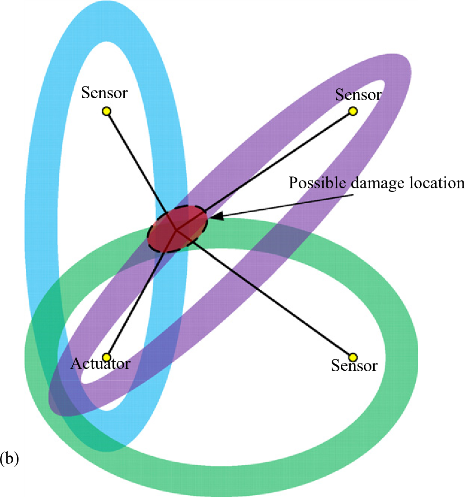
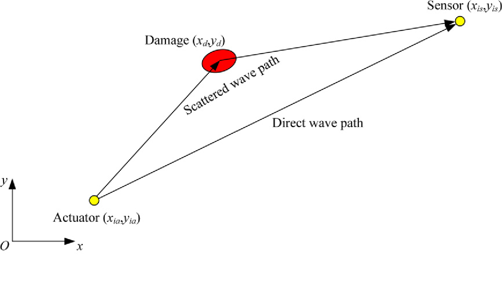

# A Bayesian approach for damage localization in plate-like structures using Lamb waves
使用兰姆波在板状结构中进行损伤定位的贝叶斯方法 
$ \mathrm{author:} $ $ \mathfrak{KeepNaive233} $

[TOC]

## 文章翻译(Translate by Google)

### 1. Introduction

> Over the past twenty years, structural health monitoring (SHM) technology has gained significant attention in research and engineering communities. The increasing emphasis on the integrity of critical structures such as aircraft urges the needs to monitor the structures in situ and real-time to detect damage at an early stage to prevent catastrophic failure [1, 2]. Since the Lamb wave-based technique can detect small areas of local damage in plate-like structures, it is considered as a promising candidate in the application of future online SHM systems. A wide range of theoretical, numerical and experimental studies have been performed to assess the effectiveness and applicability of damage detection and identification using Lamb waves [3, 4].

在过去的二十年中，结构健康监测 (SHM) 技术在研究和工程界引起了极大的关注。 对飞机等关键结构完整性的日益重视促使需要对结构进行现场和实时监控，以便在早期阶段检测损坏，以防止灾难性故障 [1, 2]。 由于基于 Lamb 波的技术可以检测板状结构中的小区域局部损伤，因此它被认为是未来在线 SHM 系统应用的有希望的候选者。 已经进行了广泛的理论、数值和实验研究，以评估使用兰姆波 [3, 4] 进行损伤检测和识别的有效性和适用性。

> Usually in the Lamb wave-based technique, piezoelectric transducers are embedded in or surface mounted on the structure both as actuators and sensors. When a diagnostic Lamb wave excited by the actuator encounters the damage, part of the wave will be scattered. Compared with the wave signals in the undamaged state (baseline signals), the scattered waves received by the sensors can be obtained simply by subtraction of the damaged and undamaged wave signals in each actuator–sensor path. The scattered waves contain characteristic information about the damage, and intuitively, the time-of-flight (ToF) of the scattered waves is related to the  using the ToF of the scattered waves to localize damage is a straightforward method [5–10]. For instance, Raghavan and Cesnik [5] used three collocated actuator/sensor pairs working on pulse-echo mode to localize damage; three circles of radii equal to the radial locations which are obtained by the product of the ToF of the damage-reflected waves and pre-calculated wave velocities intersect at the location of damage. For the sensor network working on pitch-catch mode, Kehlenbach et al [6] and Tua et al [7] employed a geometric approach with each pair of transducers as the foci of an ellipse of possible damage location. Figure 1(a) shows an illustration of this ellipse damage localization method in the case of using three actuator/sensor pairs. The point at which all three loci intersect is considered as the location of damage, while the points with which only two loci intersect are considered as pseudodamage locations. Lemistre et al [8] and Su et al ^9] identified the damage location by solving a set of nonlinear equations describing the relationships among damage location, wave velocities and ToF. Lu et al [10] solved this set of equations using a nonlinear least squares Gauss–Newton optimization algorithm to locate the damage.

通常在基于兰姆波的技术中，压电换能器作为执行器和传感器嵌入或表面安装在结构中。当执行器激发的诊断兰姆波遇到损坏时，部分波将被散射。与未损坏状态的波信号（基线信号）相比，传感器接收到的散射波可以简单地通过在每个执行器-传感器路径中减去损坏和未损坏的波信号来获得。散射波包含有关损伤的特征信息，直观地说，散射波的飞行时间（ToF）与使用散射波的飞行时间来定位损伤是一种直接的方法[5-10]。例如，Raghavan 和 Cesnik [5] 使用了三个以脉冲回波模式工作的并置的执行器/传感器对来定位损坏；三个半径圆等于径向位置，它们由损伤反射波的 ToF 和预先计算的波速在损伤位置相交获得。对于以一发一收模式工作的传感器网络，Kehlenbach 等人 [6] 和 Tua 等人 [7] 采用几何方法，将每对换能器作为可能损坏位置的椭圆的焦点。图 1(a) 显示了在使用三个致动器/传感器对的情况下这种椭圆损伤定位方法的图示。所有三个位点相交的点被认为是损坏的位置，而只有两个位点相交的点被认为是假损坏的位置。 Lemistre 等人 [8] 和 Su 等人 [9] 通过求解一组描述损伤位置、波速和 ToF 之间关系的非线性方程来确定损伤位置。 Lu 等人 [10] 使用非线性最小二乘高斯-牛顿优化算法求解了这组方程以定位损伤。

> However, there is a prerequisite in these traditional ToF-based damage localization approaches. That is, all of the measured ToF values and the corresponding theoretical wave velocities are accurate. In reality, errors and uncertainties are always unavoidable in the measurement and identification process. For example, the size and extent of the damage  scattering is uncertain, which in turn affects the theoretical prediction of the ToF of the scattered Lamb waves; also the sizes of the actuator and sensor are usually not considered in damage localization, which may introduce error in the identification result. In addition, due to the dispersive nature of Lamb waves, the waveforms of the scattered waves are always distorted, affecting the accuracy of the ToF measurement. Depending on the ToF measurement method, the measured ToF values may be different. A variety of methods for increasing the accuracy of ToF measurement of Lamb waves have been developed, including short-time Fourier transform (STFT), Wigner–Ville distribution (WVD), continuous wavelet transform (CWT), Hilbert–Huang transform (HHT) and matching pursuit (MP) algorithm [11, 12, 7, 5] approaches. Nonetheless, as pointed out by Niri and Salamone in a recent paper [13], even by employing CWT which has good resolution both in time and frequency domains, systematic uncertainty could exist due to the Heisenberg uncertainty principle. Besides, uncertainties may arise from the theoretical wave velocities, since they depend on the material property values of a specific structure, which may have variations from those nominal values and be influenced by several factors, such as environmental temperature changes [14]. As a result, rather than the damage being located in a single point, it can be located anywhere in the dark overlapped region as shown in figure 1(b).

然而，这些传统的基于 ToF 的损伤定位方法有一个先决条件。也就是说，所有测量的 ToF 值和相应的理论波速都是准确的。在现实中，误差和不确定性在测量和识别过程中总是不可避免的。例如，损伤散射的大小和程度不确定，进而影响散射兰姆波ToF的理论预测；此外，在损伤定位中通常不考虑执行器和传感器的尺寸，这可能会导致识别结果出现误差。另外，由于兰姆波的色散特性，散射波的波形总是失真，影响ToF测量的准确性。根据 ToF 测量方法，测得的 ToF 值可能会有所不同。已经开发了多种提高兰姆波 ToF 测量精度的方法，包括短时傅里叶变换 (STFT)、维格纳-维尔分布 (WVD)、连续小波变换 (CWT)、希尔伯特-黄变换 (HHT)和匹配追踪 (MP) 算法 [11, 12, 7, 5] 方法。尽管如此，正如 Niri 和 Salamone 在最近的一篇论文 [13] 中指出的那样，即使采用在时域和频域都具有良好分辨率的 CWT，由于海森堡不确定性原理，系统不确定性也可能存在。此外，理论波速可能会产生不确定性，因为它们取决于特定结构的材料属性值，这些值可能与标称值有所不同，并受环境温度变化等多种因素的影响[14]。因此，损坏不是位于单个点，而是可以位于黑暗重叠区域的任何位置，如图 1(b) 所示。

Fig.1 Damage localization using the ToF-based ellipse method with uncertainty.   使用具有不确定性的基于 ToF 的椭圆方法进行损伤定位。

> Under such a situation, probabilistic approaches may be more appropriate than deterministic approaches for damage localization in that probability distributions can be used to quantify the various uncertainties. Zhao et al [15] introduced probabilistic analysis into a tomographybased damage imaging method to improve the damage localization performance of the Lamb wave-based method. This probabilistic imaging method has been extended to complex structures and structures with multiple damaged areas [16, 17]. Flynn et al [18] proposed a maximum a posteriori probability (MAP) estimation method to increase the probability of damage detection and localization. Su et al [19–21] introduced a probability density function (PDF) to retrofit the traditional damage localization way in the ToF-based method. For each loci, a probability distribution map can be given for the detection target plant structure based on the PDF of damage occurrence. Combination of all the probability distribution maps can give the final damage detection result. Recently, Niri and Salamone proposed a probabilistic approach for acoustic emission damage localization in plate-like structures based on an extended Kalman filter (EKF) approach. The main advantage of the EKF algorithm over traditional methods is that it can take velocity [13].

在这种情况下，概率方法可能比确定性方法更适合用于损伤定位，因为概率分布可用于量化各种不确定性。 Zhao 等人 [15] 将概率分析引入基于断层扫描的损伤成像方法中，以提高基于 Lamb 波方法的损伤定位性能。这种概率成像方法已扩展到复杂结构和具有多个受损区域的结构 [16, 17]。 Flynn 等人 [18] 提出了一种最大后验概率 (MAP) 估计方法，以增加损伤检测和定位的概率。 Su 等人 [19-21] 引入了概率密度函数 (PDF) 来改进基于 ToF 方法中的传统损伤定位方式。对于每个位点，可以基于损伤发生的PDF给出检测目标植物结构的概率分布图。所有概率分布图的组合可以给出最终的损伤检测结果。最近，Niri 和 Salamone 提出了一种基于扩展卡尔曼滤波器 (EKF) 方法的板状结构中声发射损伤定位的概率方法。 EKF 算法相对于传统方法的主要优势在于它可以采用速度 [13]。

> The aim of this work is to apply the Bayesian system identification approach to the damage localization problem using the measured ToF of the scattered Lamb waves, while considering the uncertainties from modeling and measurement. The rest of this paper is structured as follows. Section 2 describes the proposed Bayesian approach for damage localization using scattered Lamb waves. Section 3 outlines the main characteristics of the CWT for measuring the ToF using a complex Morlet wavelet. In section 4, an introduction of the Markov chain Monte Carlo distribution of unknown parameters is presented. A numerical study for an aluminum plate and experimental studies for a stiffened aluminum panel and a composite laminate are presented in sections 5 and 6, respectively, to validate the proposed damage localization approach. Final conclusions are given in section 7.

这项工作的目的是将贝叶斯系统识别方法应用于使用散射兰姆波的测量 ToF 的损伤定位问题，同时考虑建模和测量的不确定性。 本文的其余部分结构如下。 第 2 节描述了使用散射兰姆波进行损伤定位的贝叶斯方法。 第 3 节概述了使用复 Morlet 小波测量 ToF 的 CWT 的主要特征。 第 4 节介绍了未知参数的马尔可夫链蒙特卡罗分布。 第 5 节和第 6 节分别介绍了铝板的数值研究以及加筋铝板和复合层压板的实验研究，以验证所提出的损伤定位方法。 最终结论在第 7 节中给出。

### 2. Bayesian approach for ToF-based damage localization

> The Bayesian framework in which measured data can be used to update the belief in the identification results, has previously been established and applied to structural systems by Beck and his colleagues [22–25]. One outstanding advantage of the Bayesian approach is that engineering judgments or expert knowledge can be easily incorporated into the analysis as prior information to reduce uncertainty. With the development of probabilistic methods to consider the intrinsic uncertainties of engineering structures, Bayesian approaches have played more and more important roles in SHM. It has been employed for damage assessment [26], damage prediction [27], sensor placement optimization [28], optimal SHM system design [29] and etc.

Beck 和他的同事 [22-25] 之前已经建立了贝叶斯框架，其中测量数据可用于更新对识别结果的信念，并将其应用于结构系统。 贝叶斯方法的一个突出优势是工程判断或专家知识可以很容易地作为先验信息纳入分析，以减少不确定性。 随着考虑工程结构内在不确定性的概率方法的发展，贝叶斯方法在SHM中发挥着越来越重要的作用。 它已被用于损伤评估 [26]、损伤预测 [27]、传感器放置优化 [28]、优化 SHM 系统设计 [29] 等。

> The present study employs Bayesian system identification for localizing damage based on the ToF of scattered Lamb waves. Rather than pinpointing a single solution using deterministic approaches, the Bayesian approach can provide the PDF of the unknown parameters, giving both point and interval estimates [30, 31]. The basic idea of Bayesian system identification is that it treats the parameters, usually denoted by a vector $ \boldsymbol{\theta} $, as random variables with joint distribution $ p(\boldsymbol{\theta}) $. It aims to calculate the posterior (updated) distributions of the uncertain parameters for a given set of measured data. The final parameter estimate can be taken as the mean value of the posterior or the value that maximizes the posterior distribution.

本研究采用贝叶斯系统识别基于散射兰姆波的 ToF 来定位损伤。 贝叶斯方法不是使用确定性方法来精确定位单个解决方案，而是可以提供未知参数的 PDF，同时给出点和区间估计 [30, 31]。 贝叶斯系统识别的基本思想是将参数（通常用向量 $ \boldsymbol{\theta} $ 表示）视为具有联合分布 $ p(\boldsymbol{\theta}) $ 的随机变量。 它旨在计算给定一组测量数据的不确定参数的后验（更新）分布。 最终的参数估计可以取为后验的平均值或使后验分布最大化的值。

> For plate-like structures, consider a sensor network consisting of $ N_p $ actuator–sensor paths that can excite and receive Lamb waves. In the present study, the ToF of the Lamb wave scattered by damage in the $ i $th ($ i = 1, 2, . . . ,Np $) actuator–sensor path is defined as the total time for the Lamb wave to pass from the actuator to the damage and to the sensor. Figure 2 is an illustration of a simple model for calculating the ToF of the scattered wave in the ith actuator–sensor path. This model is widely used in ToF-based damage localization in Lamb wave-based methods. Theoretically, the calculated ToF in the ith actuator–sensor path $ T_i^c $ is defined as

对于板状结构，考虑由$ N_p $ 致动器组成的传感器网络——可以激发和接收兰姆波的传感器路径。 在本研究中，Lamb 波在第 $ i $个 ($ i = 1, 2, . . , Np $) 致动器-传感器路径中因损伤而散射的 ToF 定义为 Lamb 波到达的总时间 从执行器传递到损坏处和传感器。 图 2 是用于计算第 i 个执行器-传感器路径中的散射波 ToF 的简单模型的图示。 该模型广泛用于基于 Lamb 波的方法中基于 ToF 的损伤定位。 理论上，在第 i 个执行器-传感器路径 $T_i^c$ 中计算的 ToF 定义为

Fig.1 ToF calculation model for the scattered Lamb wave in the ith actuator–sensor path.   第 i 个执行器-传感器路径中散射兰姆波的 ToF 计算模型。

$$
T_{i}^{c}=\dfrac{\sqrt{\left( x_{d}-x_{ia}\right) ^{2}+\left( y_{d}-y_{ia}\right) ^{2}}}{V_{g}\left( f\right) }+\dfrac{\sqrt{\left( xd-x_{is}\right) ^{2}+\left( y_{d}-y_{is}\right) ^{2}}}{V_{g}\left( f\right) }
\tag{1}
$$

> where $ (x_{d}, y_{d}) $, $ (x_{ia}, y_{ia}) $, and $ (x_{is}, y_{is}) $ are the coordinates of the center location of damage, actuator, and sensor in the ith actuator–sensor path, respectively. $ V_{g} $ is the wave velocity of the scattered Lamb wave at a specific excitation frequency $ f $ . In equation (1), the sizes of the actuator, sensor and area of damage are not considered. Since uncertainties from material properties may influence the accuracy of the theoretical wave velocity value, in the present study, wave velocity $ V_{g} $ in equation (1) is set as an additional unknown parameter to be identified besides the coordinate of the damage center location $ (x_{d}, y_{d}) $, rather than calculated using the nominal material property values beforehand. Thus, the unknown parameter vector in this damage localization approach is $ \boldsymbol{\theta} = [x_{d}, y_{d}, V_{g}]^{T} $. In the following part of this paper, $ \theta_{k} \; (k = 1, 2, 3) $ is used to indicate the unknown parameters in $ \boldsymbol{\theta} $ for convenience.

其中 $ (x_{d}, y_{d}) $, $ (x_{ia}, y_{ia}) $ 和 $ (x_{is}, y_{is}) $ 是中心位置的坐标分别在第 i 个执行器-传感器路径中的损坏、执行器和传感器。 $ V_{g} $ 是散射兰姆波在特定激发频率 $ f $ 下的波速。在等式 (1) 中，未考虑执行器、传感器和损坏区域的尺寸。由于材料特性的不确定性可能会影响理论波速值的准确性，因此在本研究中，将式（1）中的波速$ V_{g} $设置为除了损伤坐标之外的附加未知参数进行识别中心位置 $ (x_{d}, y_{d}) $，而不是事先使用标称材料属性值计算。因此，这种损伤定位方法中的未知参数向量为$ \boldsymbol{\theta} = [x_{d}, y_{d}, V_{g}]^{T} $。在本文的以下部分中，为方便起见，$ \theta_{k} \; (k = 1, 2, 3) $ 用于表示 $ \boldsymbol{\theta} $ 中的未知参数。

> After the unknown parameters are defined, damage localization is formulated as a parameter identification problem to be solved from a probabilistic point of view. Assume the modeling error and measurement uncertainty are described by two variables $ ε_{1} $ and $ ε_{2} $, respectively. The measured ToF in the ith actuator–sensor path $ T_{m}^{i} $ can be expressed as

在定义了未知参数之后，损伤定位被表述为一个参数识别问题，从概率的角度来解决。 假设建模误差和测量不确定性分别由两个变量 $ ε_{1} $ 和 $ ε_{2} $ 描述。 在第 i 个执行器-传感器路径 $T_{m}^{i}$ 中测量的 ToF 可以表示为

$$
T_{i}^{m}=T_{i}^{c}\left( \boldsymbol{\theta} \right) +\varepsilon _{1}+\varepsilon _{2}
\tag{2}
$$

> where $ T_{i}^{c} $  using equation (1), with parameter vector $ \boldsymbol{\theta} $. For simplicity and convenience, $ ε_{1} $ and $ ε_{2} $ are usually assumed as two independent Gaussian variables with means of zero and standard deviations of $ σ_{ε1} $ and $ σ_{ε2} $ , respectively. In this case, the likelihood function can be written as

其中 $ T_{i}^{c} $ 使用等式 (1)，参数向量 $ \boldsymbol{\theta} $。 为简单和方便起见，$ ε_{1} $ 和 $ ε_{2} $ 通常假设为两个独立的高斯变量，均值为零，标准差分别为 $ σ_{ε1} $ 和 $ σ_{ε2} $ 。 在这种情况下，似然函数可以写成

$$
p\left( \boldsymbol{D}| \boldsymbol{\theta} ,\sigma _{\varepsilon }^{2}\right) =\dfrac{1}{\left( 2\pi \sigma _{\varepsilon }^{2}\right) ^{Np/2}}\times \exp \left[ -\dfrac{1}{2\sigma _{\varepsilon }^{2}}\sum ^{Np}_{i=1}\left( T_{i}^{m}-T_{i}^{c}\left( \boldsymbol{\theta} \right) \right) ^{2}\right]
\tag{3}
$$

> where the variance $ \sigma _{\varepsilon }^{2}=\sigma _{\varepsilon1 }^{2}+\sigma _{\varepsilon2 }^{2} $. The likelihood function $ p\left( \boldsymbol{D}| \boldsymbol{\theta} ,\sigma _{\varepsilon }^{2}\right) $ is a probabilistic statement about the distribution of the measured ToF data $ D=\left[ T_{1}^{m},T_{2}^{m},\ldots ,T_{Np}^{m}\right] $ given the predicted ToF values, determined by equation (1) and parameter vector $ \boldsymbol{\theta} $. For convenience, the sum of squares in the likelihood function in equation (3) can be defined as

其中方差 $ \sigma _{\varepsilon }^{2}=\sigma _{\varepsilon1 }^{2}+\sigma _{\varepsilon2 }^{2} $。似然函数 $ p\left( \boldsymbol{D}| \boldsymbol{\theta} ,\sigma _{\varepsilon }^{2}\right) $ 是关于给定预测 ToF 值的测量 ToF 数据 $ \boldsymbol{D}=\left[T_{1}^{m},T_{2}^{m},\ldots ,T_{Np}^{m}\right] $ 分布的概率陈述，由等式 (1) 和参数向量 $ \boldsymbol{\theta} $ 确定

$$
Q\left( \boldsymbol{D},\boldsymbol{\theta} \right) =\sum ^{Np}_{i=1}\left( T_{i}^{n}-T_{i}^{C}\left( \boldsymbol{\theta} \right) \right) ^{2}
\tag{4}
$$

> Using Bayes’ theorem, the posterior PDF of the parameters for a given set of measured ToF data is constructed by relating the prior PDF and the likelihood function as

使用贝叶斯定理，给定一组测量的 ToF 数据的参数的后验 PDF 是通过将先验 PDF 和似然函数关联起来构建的

略

### 4. Markov chain Monte Carlo method

> Posterior distributions used in Bayesian inference are often complicated, making it difficult to draw independent samples for the standard Monte Carlo method. In this case, MCMC simulation is usually employed as an alternative choice for sampling. The result of MCMC is a dependent sequence of samples (a Markov chain) that has stationary distributions equal to the target distribution.

贝叶斯推理中使用的后验分布通常很复杂，因此很难为标准蒙特卡罗方法绘制独立样本。 在这种情况下，MCMC 模拟通常用作采样的替代选择。 MCMC 的结果是一个依赖的样本序列（马尔可夫链），其平稳分布等于目标分布。

> The pioneering work on MCMC was done by Metropolis and his colleagues in the 1950s. They recognized that Markov chains could be applied to some difficult sampling problems. After about two decades, Hastings expanded and formalized MCMC into the procedure now known as the Metropolis–Hastings (MH) algorithm for performing such sampling [34]. Let $ \pi(x) $ be the target PDF from which random samples are desired. The MH algorithm generates a sequence of $ \{ x^{n} \} $ for the target distribution $ \pi(x) $ by a two-step rejection sampling procedure. At stage $ n $, a candidate value $ x^{*} $ is sampled based on the current value $ x^{n-1} $; it is sampled from a chosen proposal distribution function $ h(x^{*} | x^{(n-1)}) $. 

MCMC 的开创性工作是由 Metropolis 和他的同事在 1950 年代完成的。 他们认识到马尔可夫链可以应用于一些困难的抽样问题。 大约二十年后，Hastings 将 MCMC 扩展并形式化为现在称为 Metropolis-Hastings (MH) 算法的程序，用于执行此类采样 [^34]。设 $\pi(x)$ 是需要随机样本的目标 PDF。 MH 算法通过两步拒绝抽样过程为目标分布 $\pi(x)$ 生成一个 $\{x^{n}\}$ 序列。

