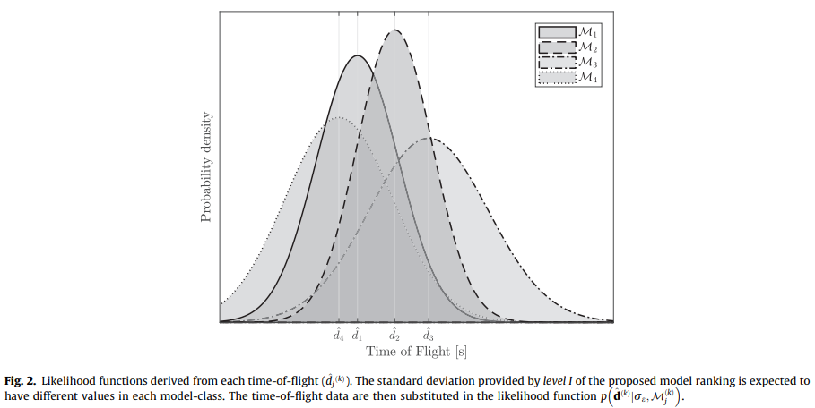

# A robust Bayesian methodology for damage localization in plate-like structures using ultrasonic guided-waves

一种使用超声导波在板状结构中进行损伤定位的稳健贝叶斯方法

[TOC]

## Abstract

> SHM methods for damage detection and localization in plate-like structures have typically relied on signal post-processing techniques applied to ultrasonic guided-waves. The time of flight is one of these signals features which has been extensively used by the SHM community for damage localization. One approach for obtaining the time of flight is by applying a particular time-frequency transform to capture the frequency and energy content of the wave at each instant of time. To this end, the selection of a suitable methodology for time-frequency transform among the many candidates available in the literature has typically relied on experience, or simply based on considerations about computational efficiency. In this paper, a full probabilistic method based on the Bayesian inverse problem is proposed to rigorously provide a robust estimate of the time of flight for each sensor independently. Then, the robust prediction is introduced as an input to the Bayesian inverse problem of damage localization. The results reveal that the proposed methodology is able to efficiently reconstruct the damage localization within a metallic plate without the need to assume a specific a priori time-frequency transform model.

用于板状结构的损伤检测与定位的SHM方法通常依赖于超声导波的信号后处理技术。飞行时间作为这些信号特征之一，已经被SHM社区广泛的应用于损伤定位。一种获得飞行时间的方法是通过应用特定的时频转换来捕获波在每个时刻的频率和能量(的含量)。为此，在文献中很多研究者为时频转换选择一个合适的方法通常依赖于经验，或者仅仅是基于对计算效率的考虑。在本文中，提出了一种基于贝叶斯逆问题的全概率方法，以严格独立地为每个传感器提供飞行时间的稳健估计。然后，引入稳健预测作为损伤定位的贝叶斯逆问题的输入。结果表明，所提出的方法能够有效地重建金属板内的损伤定位，而无需假设特定的先验时频变换模型。

## 1. Introduction

> Damage reconstruction and localization in plate-like structures using guided-waves based SHM have been mainly addressed using post-processing techniques applied to ultrasonic signals [1]. The exploration of large areas with a small attenuation [2] is one of the most remarkable characteristics that has led industries, such as the aerospace industry, to focus on guided-waves (e.g. the ‘‘PAMELA” system [3–5]). Other approaches that use acoustic-based SHM methods to localize damage in thin-walled structures are also available nowadays. These can be broadly classified into (1) passive sensing diagnostics (PSD) and (2) active sensing diagnostics (ASD) techniques. In contrast to PSD techniques, which are based on sensors in ‘‘listening-mode” (e.g., acoustic emission) [6–12], ASD techniques for plate-like structures emit ultrasonic waves that interact with the structure and are measured by sensors [13]. Sparse or phased-array sensors’ layouts are placed so that the structure is actively interrogated on demand, which confers higher accuracy and reliability [14]. Potential safety and economical implications in condition-based maintenance are extra-motivations for the use of this SHM technique.

使用基于导波的 SHM 在板状结构中的损伤重建和定位主要是使用应用于超声波信号的后处理技术来解决的 [^1]。探索具有小衰减的大区域 [^2] 是导致航空航天工业等行业关注导波的最显着特征之一 (例如“PAMELA”系统 [^3] [^4] [^5] )。现在也有其他使用基于声学的 SHM 方法来定位薄壁结构损伤的方法。这些可以大致分为 (1) 无源传感诊断技术 (PSD) 和 (2) 有源传感诊断技术 (ASD)。与基于“收听模式” (例如声发射) [^6] [^7] [^8] [^9] [^10] [^11] [^12] 的传感器的 PSD 技术相比，用于板状结构的 ASD 技术会发射与结构相互作用并由传感器测量的超声波 [^13]。放置稀疏或相控阵传感器的布局，以便根据需要主动询问结构，从而提供更高的准确性和可靠性[^14]。在基于条件的维护中，潜在的安全和经济意义是使用这种SHM技术的额外动机。

> Moreover, the need for autonomous techniques that provide accurate health state indicators is specially crucial for aerospace structures, which are based on a considerable number of critical structural components requiring frequent inspection. Once a damaged area is detected, i.e. through analysis of damage tolerance exceedance, proper operational decisions can be taken. Two general approaches are typically adopted for damage detection: (1) model-based inverse problems, whereby detailed damage information (e.g. the severity of damage as residual strength) [15] can be obtained from the measured signal at a considerable computational cost; and (2) inverse problems based on post-processed signal features, whereby other relevant information, e.g. the damage position or the damage severity, can be obtained more efficiently. With regards to the second approach, several damage reconstruction techniques have been reported in the literature [2,16–18]. Among them, the time-of-flight (ToF) has been extensively used as a signal feature for its efficiency in obtaining information about material properties along with damage localization using post-processing scattered signals.

此外，对提供准确健康指标的自主技术的需求对航空航天结构尤为重要，因为这些结构基于大量需要需要频繁检查的关键结构部件。一旦检测到损坏区域，即通过分析损坏容限超出范围，就可以做出适当的操作决策。损伤检测通常采用两种通用方法: (1) 基于模型的逆问题，从而可以从测量信号中以相当大的计算成本获得详细的损伤信息 (例如，损坏的严重程度作为剩余强度) [^15]；(2) 基于后处理信号特征的逆问题，从而可以更有效地获取其他相关信息，例如损坏位置或损坏严重程度。关于第二种方法，文献中描述了几种损伤重建技术 [^2] [^16] [^17] [^18] 。其中，飞行时间 (ToF) 已被广泛用作一种信号特征，因为它可以有效地获取有关材料特性的信息以及随后处理散射信号进行损伤定位。

>Time-frequency (TF) representation techniques have been intensively used for the extraction of ToF as a signal feature. By TF representation, a frequency domain spectrum can be obtained at each instant of time [19], however the results slightly differ from each other depending on the adoption of the various approaches available in the literature. Amongst them, the Hilbert-Huang transform (HHT), the continuous wavelet transform (CWT), the short-time Fourier transform (STFT) and the Wigner-Ville distribution (WVD) [19–22], are some of the most commonly used techniques in ultrasonic guided-waves based SHM applications [23–25]. Typically, the selection of one among the available options has been based on the modeler’s experience or based on specific TF resolution characteristics. However, the selection of an unappropriated model may result in a biased damage identification [26,27] due to the disparate model assumptions and hypotheses adopted for each of them. In other words, the choice of a particular TF approach instead of another one is subject to epistemic uncertainty (i.e., lack of knowledge). Moreover, ultrasound-based damage localization conveys other sources of uncertainty which are mostly related with the measurement system and physical properties of the material. They might produce unreliable damage predictions should these uncertainties are not properly considered and quantified within the calculations.

时频 (TF) 表示技术已被广泛用于提取 ToF 作为信号特征。通过 TF 表示，可以在每个时刻获得频域频谱 [^19]，但是根据文献中可用的各种方法，彼此的结果略有不同。其中，Hilbert-Huang 变换 (HHT)、连续小波变换 (CWT)、短时傅里叶变换 (STFT) 和 Wigner-Ville 分布 (WVD) [^19] [^20] [^21] [^22] 是基于超声导波的 SHM 应用中最常用的一些技术 [^23] [^24] [^25]。通常，根据建模者的经验或基于特定的 TF 分辨率特征，从可用选项中选择一个。然而，由于模型假设和假设各不相同，选择不合适的模型可能会导致损害识别有偏差 [^26] [^27]。换句话说，选择特定的 TF 方法而不是另一种方法受认知不确定性的影响(例如，缺少知识)。此外，基于超声波的损伤定位还传达了其他不确定性来源，这些不确定性主要与测量系统和材料的物理特性有关。如果在计算中没有适当考虑和量化这些不确定性，它们可能会产生不可靠的损坏预测。

> To partially address this modeling issue, a number of researchers have proposed the use of probability-based methods [28–30]. Among them, the Bayesian inverse problem (BIP) applied to ultrasound based damage localization is getting increasing attention within the SHM community, although it is still in its early stage. In [24], the BIP was successfully proven in localizing damage areas in aluminum plates. More recently, a BIP methodology to account for the anisotropy in the group velocity was proposed in [23] for composite laminates. Notwithstanding, there is still an evident need for a rigorous treatment of the uncertainty in modeling the damage localization using ultrasonic guided-waves based methods, overall when multiple damage locations are expected.

为了部分解决这个建模问题，许多研究人员提出了使用基于概率的方法 [^28] [^29] [^30]。其中，应用于基于超声的损伤定位的贝叶斯逆问题（BIP）在 SHM 社区中越来越受到关注，尽管它仍处于早期阶段。在 [^24] 中，BIP 被成功地证明可以定位铝板的损伤区域。最近，在 [^23] 中提出了一种用于解释复合层压板的群速度各向异性的 BIP 方法。尽管如此，仍然明显的需要严格处理使用基于超声导波的方法来应对损伤定位进行建模时的不确定性，总体而言，当预计会有多个损伤位置时。

> This paper proposes a multi-level Bayesian framework to rigorously account for the overall uncertainty in application to the problem of ultrasound-based damage localization using Lamb waves. The main novelty of this paper is that it provides a unified methodology to rationally address the problem of damage identification using ultrasounds from probabilistic Bayesian principles: first, the problem of TF model selection is addressed for a given experimental configuration based on posterior probabilities that assess the relative degree of belief [31] of a particular model over a set of candidates; then, the problem of damage identification and localization is carried out using a BIP based on signal features adopting a hyper-robust TF model resulted from the first assessment level. To this end, once the raw data have been acquired, two BIPs are hierarchically formulated for each piezoelectric (PZT) sensor so that the outcome of the model selection problem is used as input for damage localization, as shown in Fig. 1. In this framework, uncertainties coming from (1) material’s mechanical properties, (2) measurement errors, and (3) epistemic uncertainty in the TF model due to the Heisenberg principle [19,30], are taken into account. The proposed approach relies on rigorous probability-logic assumptions for model class selection [32] and as such, it avoids experience-based decisions about the optimal post-processing technique. Here, probability is interpreted as a multi-valued logic that expresses the degree of belief of a proposition conditioned on the given information [33,32]. The methodology is applied in two case studies using aluminum plates with one and two damaged areas, respectively. For the particular problem of damage localization, the asymptotic independent Markov sampling (AIMS) [34,35] algorithm is adopted to solve the resulting Bayesian inverse problem, showing high efficiency in dealing with damage multi-modality. In general, the results show the efficiency of the proposed methodology in reconstructing the damage position in platelike structures using guided-waves, while rigorously accounting for the modeling uncertainties in the reconstruction.

本文提出了一个多层次的贝叶斯框架，以严格解释应用兰姆波基于超声的损伤定位问题的整体不确定性。首先，基于后验概率的给定实验配置解决了 TF 模型选择问题，后验概率评估特定模型在一组候选上的相对置信度 [^31]；然后，使用基于信号特征的 BIP 进行损伤识别和定位问题，该模型采用来自第一评估级别的超稳健 TF 模型。为此，一旦获取了原始数据，就会为每个压电 (PZT) 传感器分层制定两个 BIP，以便将模型选择问题的结果用作损伤定位的输入，如图 1 所示。在这个框架中，由于海森堡原理 [^19] [^30]，来自 (1) 材料的机械性能、(2) 测量误差和 (3) TF 模型中的海森堡原理造成的认知不确定性的不确定性被考虑在内。所提出的方法依赖于模型类选择的严格概率逻辑假设 [^32]，因此，它避免了基于经验的关于最佳后处理技术的决策。在这里，概率被解释为一种多值逻辑，它表示以给定信息为条件的命题的可信度 [^33] [^32]。该方法应用于两个案例研究，分别使用具有一个和两个损坏区域的铝板。针对损伤定位的特殊问题，采用渐近独立马尔可夫采样 (AIMS) [^34,35] 算法来解决由此产生的贝叶斯逆问题，在处理损伤多模态方面表现出较高的效率。总的来说，结果显示了所提出的方法在使用导波重建板状结构中的损伤位置方面的高效性，同时严格考虑了重建中的建模不确定性。

> The remainder of the paper is organized as follows: Section 2 shows the TF models used in the proposed model selection problem. Section 3 comprises the probabilistic methodology used to obtain the robust estimate of the ToF for each sensor. The BIP principles used to obtain the damage localization are presented in Section 4. In Section 5, the proposed framework is applied in two case studies to serve as example. Section 6 discusses the robustness of the proposed methodology. Finally, Section 7 provides concluding remarks.

在本文的其余部分安排如下：第 2 节展示了模型选择问题中使用的 TF 模型。第 3 节包含用于获得每个传感器的 ToF 的稳健估计的概率方法。第 4 节介绍了用于获得损伤定位的 BIP 原理。第 5 节中提出的框架应用于两个案例研究以作为示例。第 6 节讨论了所提出方法的稳健性。最后，第 7 节提供了结论性意见。

## 2. Time-frequency models

>Among the most used TF models in the literature, four of them are selected in this paper to be assessed and ranked using the proposed Bayesian methodology for each sensor, independently; namely the HHT, CWT, STFT, and WVD. The main formulation of these TF representation techniques is shown in the following subsections.

本文选择了4个在文献中最常用的 TF 模型，使用所提出的贝叶斯方法对每个传感器独立进行评估和排序； 即 HHT、CWT、STFT 和 WVD。这些 TF 表示技术的主要公式显示在如下小节中。

### Hilbert-Huang transform

> The HHT is obtained by the sum of intrinsic mode functions (IMF) whereby the spectrum is defined after performing the Hilber transform over each IMF component [20,26], as follows:

HHT 是通过固有模式函数 (IMF) 的总和获得的，由此在对每个 IMF 分量执行 Hilber 变换后定义频谱 [^20] [^26]，如下所示：

$$
g_{i}\left( t\right) =\sum ^{n}_{j=1}\alpha _{j}\left( t\right) \exp \left( i\int \omega _{j}\left( t\right) dt\right) 
\tag{1}
$$

> where $ \alpha _{j}\left( t\right) $ is the magnitude of the analytic signal which is typically considered as the envelope of the input time series or directly the signal acquired by the sensor, $ n $ is the number of IMF components, and $ \omega _{j}\left( t\right) $ is the instantaneous frequency.Eq. (1) represents the amplitude and instantaneous frequency as function of time.

其中 $ \alpha _{j}\left( t\right) $ 是解析信号的幅度，通常被认为是输入时间序列的包络或直接被传感器获取的信号，$ n $ 是数字 IMF 分量，$ \omega _{j}\left( t\right) $ 是瞬时频率。方程 (1) 表示作为时间函数的幅度和瞬时频率。

### Continuous wavelet transform

> TF wavelets are used in the CWT to obtain the TF representation of the assessed signal, by:

TF 小波在 CWT 中用于获得评估信号的 TF 表示，方法是：

$$
g_{2}\left( b,a\right) =\dfrac{1}{\sqrt{a}}\int ^{\infty }_{-\infty }X\left( t\right) \overline{\Psi \left( \dfrac{t-b}{a}\right) dt}
\tag{2}
$$

> where $ X\left( t\right) $ represents the time series of the signal, $ \Psi \left( t\right) $ denotes the analysing wavelet, $ a > 0 $ is the scale factor, $ b $ is the timeshift variable, and the overline denotes the complex conjugate [21,36].  Remarkable time and frequency resolution are obtained using this model.

其中 $ X\left( t\right) $ 表示信号的时间序列， $ \Psi \left( t\right) $ 表示分析小波， $ a > 0 $ 是缩放因子， $ b $ 是时移因子，上划线表示复共轭 [^21] [^36]。使用该模型获得了显着的时间和频率分辨率。 

### Short-time Fourier transform

> Alternatively, the TF representation can be obtained with a STFT, which performs Fourier transforms to a moving window in the assessed signal [19,37], as follows:

或者，可以使用 STFT 表示 TF，该 STFT 对评估信号中的移动窗口执行傅里叶变换 [^19] [^37]，如下所示：

$$
g_{3}\left( \omega ,t\right) =\dfrac{1}{2\pi }\int _{-\infty }^{\infty }e^{-i\omega t}X\left( \tau \right) h\left( \tau -t\right) d\tau
\tag{3}
$$

> where $ X\left( t\right) $ is the time series, $ h\left( t\right) $ a window function, and \omega denotes the frequency. The energy spectrum of an STFT is known as a spectrogram.

其中 $ X\left( t\right) $ 是时间序列， $ h\left( t\right) $ 是窗口函数， $ \omega $ 表示频率。STFT 的能谱称为谱图。

### Wigner-Ville distribution

> The WVD can be interpreted as a measure of the signal’s local time-frequency energy [37], and it is defined as follows:

WVD 可以解释为信号本地时频能量的量度 [^37]，其定义如下：

$$
g_{4}\left( \omega ,t\right) =\int _{-\infty }^{\infty }X\left( t+\dfrac{\tau }{2}\right) \overline{X\left( t-\dfrac{\tau }{2}\right) }e^{-i\omega t}d\tau
\tag{4}
$$

> where $ X\left( t\right) $ is the time series and the overline denotes the complex conjugate. This technique is highly effective in detecting and localizing Dirac impulses and sinusoids [19,37].

其中 $ X\left( t\right) $ 是时间序列，上划线表示复共轭。 这种技术在检测和定位狄拉克脉冲和正弦曲线方面非常有效 [^19] [^37]。

##  Bayesian model class ranking

> The TF models in Section 2 are just different alternatives based on a number of simplifying hypotheses and modeling assumptions to represent the same reality. Instead, for a particular model, the validity of such simplifying assumptions depends on the adopted values of certain model parameters (e.g. the dispersion parameter). Thus, to simultaneously identify both the plausibility of each TF model and the values of the model parameters that better suit the information coming from the raw ultrasonic data, a Bayesian inverse problem (BIP) is proposed here. Given a plate-like structure monitored through a set of PZT sensors, the BIP is addressed separately for each PZT sensor due to the potential differences between sensors, such as different working environments or manufacturing defects.

第 2 节中的 TF 模型只是基于许多简化假设和建模假设的不同可选方案以表示现实中的相同情况。相反，对于特定模型，这种简化假设的有效性取决于某些模型参数的采用值 (例如色散参数)。因此，为了同时识别每个 TF 模型的合理性和更适合来自原始超声数据的信息的模型参数值，提出了贝叶斯逆问题 (BIP)。给定通过一组 PZT 传感器监控的板状结构，由于传感器之间的电位差异，例如不同的工作环境或制造缺陷，BIP 将针对每个 PZT 传感器单独处理。

###  Stochastic embedding of TF models

> Let us consider a candidate TF model defined by the relationship $ g_{j} $ : $ \mathbb{R}^{n} \to \mathbb{R} $ between a discrete signal $ \mathcal{D}^{(k)} \in \mathbb{R}^{n} $ acting as input and the model output $ g_{j} \in \mathbb{R}^{n} $, where k denotes the k-th sensor in the structure. Next, let $ \widehat{d}^{(k)}_{j} $ be the first energy peak observed in the scattered ultrasound signal, so that $ \widehat{d}^{(k)}_{j} = g_{j}(\mathcal{D}^{(k)}) $. Under the assumption that $ g_{j} $ is only a candidate model over a set of alternatives [^32] (e.g. like those described in Section 2), then the measured first peak, denoted here as $ \widetilde{d}^{(k)} $, would be more rigorously represented as an uncertain variable, as follows:

让我们考虑一个由关系 $ g_{j} $ 定义的候选 TF 模型： $ \mathbb{R}^{n} \to \mathbb{R} $ 在离散信号 $ \mathcal{D}^{(k )} \in \mathbb{R}^{n} $ 作为输入和模型输出 $ g_{j} \in \mathbb{R}^{n} $，其中 k 表示结构中的第 k 个传感器 . 接下来，令$ \widehat{d}^{(k)}_{j} $ 为散射超声信号中观察到的第一个能量峰值，使得$ \widehat{d}^{(k)}_{j} = g_{j}(\mathcal{D}^{(k)}) $. 假设 $ g_{j} $ 只是一组备选方案 [^32] 上的候选模型（例如，如第 2 节中描述的那些），那么测量的第一个峰值，这里表示为 $ \widetilde{d}^ {(k)} $，将更严格地表示为不确定变量，如下所示：

$$
\widehat{d}^{(k)}_{j} = g_{j}(\mathcal{D}^{(k)}) + \varepsilon
\tag{5}
$$

> where $ \varepsilon $ is an uncertain error term which accounts for the discrepancy between $ \widehat{d}^{(k)}_{j} $ and $ \widetilde{d}^ {(k)} $, namely the modeled and measured values for the first energy peak, respectively. Following the Principle of Maximum Information Entropy (PMIE) [^32][^33], this error can be conservatively assumed to be modeled as a zero-mean Gaussian distribution with standard deviation $ \sigma_{\varepsilon} $, i.e., $ \sigma \sim \mathcal{N}(0, \sigma_{\varepsilon})  $. The PMIE enables a rational way to establish a probability model for the model error term such that it produces the largest uncertainty (largest Shannon entropy); the selection of any other probability model would lead to an unjustified reduction in such uncertainty [^32]. Thus, following Eq. (5), a probabilistic description of the TF model can be obtained as:

其中 $ \varepsilon $ 是一个不确定的误差项，它解释了 $ \widehat{d}^{(k)}_{j} $ 和 $ \widetilde{d}^ {(k)} $ 之间的差异，即 分别为第一个能量峰值的建模和测量值。 遵循最大信息熵原理（PMIE）[^32][^33]，可以保守地假设这个误差被建模为标准差为$\sigma_{\varepsilon}$的零均值高斯分布，即$ \sigma \sim \mathcal{N}(0, \sigma_{\varepsilon}) $. PMIE 能够以合理的方式为模型误差项建立概率模型，使其产生最大的不确定性（最大的香农熵）； 选择任何其他概率模型都会导致这种不确定性的不合理减少 [^32]。 因此，遵循等式(5)，TF模型的概率描述可以得到：

$$
p(\widetilde{d}^ {(k)} | \mathcal{M}^{(k)}_j, \sigma_{\varepsilon}) = (2\pi \sigma^{2}_{\varepsilon})^{-\frac{1}{2}}exp(-\frac{1}{2}(\frac{\widetilde{d}^ {(k)} - g^{-1}_{j}(\mathcal{D}^{(k)})}{\sigma_{\varepsilon}})^{2})
\tag{6}
$$

> where $ \mathcal{M}^{(k)}_j $ denotes the j-th candidate model class within a set of $ N_m $ available TF models $ \mathbf{M} = {\mathcal{M}^{(k)}_1,...,\mathcal{M}^{(k)}_j,...,\mathcal{M}^{(k)}_{N_m}}$. Each model class is defined by the stochastic TF model given by Eq. (6) along with the prior probability density function (PDF) of the model parameter $ \sigma_{\varepsilon}, p(\sigma_{\varepsilon} | \mathcal{M}^{(k)}_j)$. This prior PDF represents the initial degree of belief of the values of $ \sigma_{\varepsilon} $ within a set of possible values $ \Theta \subseteq \mathbb{R} $ before the information from measurements is incorporated through Bayesian updating, as explained further below. For all the sensors in the structure, the stochastic model is defined independently, thus accounting for different potential sources of errors and uncertainties.

其中 $ \mathcal{M}^{(k)}_j $ 表示一组 $ N_m $ 个可用 TF 模型中的第 j 个候选模型类 $ \mathbf{M} = {\mathcal{M}^{(k )}_1,...,\mathcal{M}^{(k)}_j,...,\mathcal{M}^{(k)}_{N_m}}$。 每个模型类由方程给出的随机 TF 模型定义。等式(6) 连同模型参数 $\sigma_{\varepsilon} $ 的先验概率密度函数 (PDF)，$ p(\sigma_{\varepsilon} | \mathcal{M}^{(k)}_j)$。 该先验 PDF 表示在通过贝叶斯更新合并来自测量的信息之前，在一组可能值 $ \Theta \subseteq \mathbb{R} $ 中的值的初始置信度，如 下面进一步解释。 对于结构中的所有传感器，随机模型是独立定义的，因此考虑了不同的潜在误差和不确定性来源。

### Model parameters estimation

> Previously to obtain the model parameter updating from measurements, a preliminary assessment of the influence of the dispersion parameter re in the model class assessment and ranking was carried out, which showed a relatively high sensitivity of the resulting model class assessment to the value of this parameter. Thus, a first stage of the BIP is conceived to obtain the set of most plausible values for $ \sigma_{\varepsilon} $ given a set of data $ \widehat{\boldsymbol{d}}^{(k)} = {{\widehat{d}}^{(k)}_{1},...,{\widehat{d}}^{(k)}_{N_{m}}} $, which corresponds to a set of $ N_m $ values obtained by adopting each TF model class. To this end, the posterior PDF $ p(\sigma_{\varepsilon} | \widehat{\boldsymbol{d}}^{(k)}, \mathcal{M}^{(k)}_j) $ of the dispersion parameter $\sigma_{\varepsilon} $ given the j-th TF model class $ (\mathcal{M}^{(k)_j}) $, is required. Thus, by using Bayes’ theorem, this posterior PDF is given by:

此前为了从测量中获取模型参数更新，对离散参数re在模型类评估和排序中的影响进行了初步评估，结果表明模型类评估结果对该参数的值具有较高的敏感性 . 因此，BIP 的第一阶段被设想为在给定一组数据 $ \widehat{\boldsymbol{d}}^{(k)} = { {\widehat{d}}^{(k)}_{1},...,{\widehat{d}}^{(k)}_{N_{m}}} $，对应一个集合 通过采用每个 TF 模型类获得的 $N_m$ 个值。 为此，离散度的后验 PDF $p(\sigma_{\varepsilon} | \widehat{\boldsymbol{d}}^{(k)},\mathcal{M}^{(k)}_j)$ 参数 $\sigma_{\varepsilon} $ 给定第 j 个 TF 模型类 $ (\mathcal{M}^{(k)_j}) $，是必需的。 因此，通过使用贝叶斯定理，这个后验概率密度函数由下式给出：

$$
p(\sigma_{\varepsilon} | \widehat{\boldsymbol{d}}^{(k)},\mathcal{M}^{(k)}_j) = c^{-1}p(\widehat{\boldsymbol{d}}^{(k)} | \sigma_{\varepsilon},\mathcal{M}^{(k)}_j)p(\sigma_{\varepsilon} | \mathcal{M}^{(k)}_j)
\tag{7}
$$

> where $ c $ is a normalizing constant, so that:

其中 $ c $ 是一个归一化常数，因此：

$$
\int_{\Theta}p(\sigma_{\varepsilon} | \widehat{\boldsymbol{d}}^{(k)},\mathcal{M}^{(k)}_j)d\sigma_{\varepsilon} = \int_{\Theta} c^{-1}p(\widehat{\boldsymbol{d}}^{(k)} | \sigma_{\varepsilon},\mathcal{M}^{(k)}_j)p(\sigma_{\varepsilon} | \mathcal{M}^{(k)}_j)d\sigma_{\varepsilon} = 1
\tag{8}
$$

> In Eq. (7), $ p(\sigma_{\varepsilon} | \mathcal{M}^{(k)}_j) $ is the likelihood function, which expresses how likely the data $ \widehat{\boldsymbol{d}}^{(k)} $ are reproduced by the stochastic model in Eq. (6) if model class $ \widehat{\boldsymbol{d}}^{(k)} $ is adopted, as shown in Fig. 2. This likelihood function can be obtained by substitution of the values of $ \widehat{\boldsymbol{d}}^{(k)} $ as the output of the stochastic model, as follows:

在等式 (7), $ p(\sigma_{\varepsilon} | \mathcal{M}^{(k)}_j) $ 是似然函数，表示数据 $ \widehat{\boldsymbol{d}}^ {(k)} $ 的可能性有多大由方程中的随机模型再现。 (6) 如果采用模型类$\widehat{\boldsymbol{d}}^{(k)}$，如图2所示。这个似然函数可以通过$\widehat{\boldsymbol{d}}^{(k)}$的值代入得到作为随机模型的输出，如下：

$$
p(\sigma_{\varepsilon} | \mathcal{M}^{(k)}_j) = \prod^{N_m}_{\ell=1} p(\widehat{d}^{(k)}_{\ell} | \sigma_{\varepsilon}, \mathcal{M}^{(k)}_j)
\tag{9}
$$

> Therefore, Eq. (7) rewrites as:

因此，等式(7) 改写为：

$$
p(\sigma_{\varepsilon} | \widehat{\boldsymbol{d}}^{(k)},\mathcal{M}^{(k)}_j) \propto 	\left\{{\prod^{N_m}_{\ell=1} p(\widehat{d}^{(k)}_{\ell} | \sigma_{\varepsilon}, \mathcal{M}^{(k)}_j)}\right\}p(\sigma_{\varepsilon} | \mathcal{M}^{(k)}_j)
\tag{10}
$$

> Furthermore, it is observed that the evaluation of the normalizing constant $ c $ in Eq. (7) cannot usually be evaluated analytically except for special cases based upon linear models and Gaussian uncertainties [^38]. However, stochastic simulation based on MCMC methods [^39][^40] can be used to obtain samples from the posterior avoiding the evaluation of c, as shown in the next section.

此外，观察到对等式中的归一化常数 $ c $ 的评估。等式(7)通常不能进行分析评估，除非基于线性模型和高斯不确定性的特殊情况[^38]。 然而，基于 MCMC 方法 [^39][^40] 的随机模拟可用于从后验中获取样本，避免评估 $ c $，如下一节所示。

## Model class assessment

> The probabilistic approach for model class assessment is motivated by the uncertainty about the TF model based on the assumed hypotheses and simplifications adopted for its formulation [^32][^33]. Once the posterior $ p(\sigma_{\varepsilon} | \widehat{\boldsymbol{d}}^{(k)},\mathcal{M}^{(k)}_j) $ is obtained, the plausibility of the model class $ \mathcal{M}^{(k)}_j $ can be obtained by applying the Total Probability Theorem as:

模型类评估的概率方法是基于 TF 模型的不确定性，该模型基于其公式 [^32][^33] 所采用的假设假设和简化。 一旦得到后验 $ p(\sigma_{\varepsilon} | \widehat{\boldsymbol{d}}^{(k)},\mathcal{M}^{(k)}_j) $，则 模型类 $ \mathcal{M}^{(k)}_j $ 可以通过应用总概率定理获得：

$$
P(\mathcal{M}^{(k)}_j | \widehat{\boldsymbol{d}}^{(k)}) = \int_{\Theta}P(\mathcal{M}^{(k)}_j | \widehat{\boldsymbol{d}}^{(k)}, \sigma_{\varepsilon})p(\sigma_{\varepsilon} | \widehat{\boldsymbol{d}}^{(k)})d\sigma_{\varepsilon}
= \int_{\Theta} \frac{p(\widehat{d}^ {(k)} | \mathcal{M}^{(k)}_j, \sigma_{\varepsilon})P(\mathcal{M}^{(k)}_j)}{\begin{matrix} \sum_{\ell=1}^{N_m} p(\widehat{d}^ {(k)} | \mathcal{M}^{(k)}_j, \sigma_{\varepsilon})P(\mathcal{M}^{(k)}_j) \end{matrix}}p(\sigma_{\varepsilon} | \widehat{\boldsymbol{d}}^{(k)})d\sigma_{\varepsilon}
\tag{11}
$$

> where $ p(\sigma_{\varepsilon} | \widehat{\boldsymbol{d}}^{(k)}) $ denotes the posterior PDF obtained by Eq. (10). Eq. (11) can be simplified by applying the asymptotic Laplace’s approximation [^32] as follows:

其中 $ p(\sigma_{\varepsilon} | \widehat{\boldsymbol{d}}^{(k)}) $ 表示由等式获得的后验概率密度函数。等式(10),(11)可以通过应用渐近拉普拉斯近似 [^32] 简化如下：

$$
P(\mathcal{M}^{(k)}_j | \widehat{\boldsymbol{d}}^{(k)}) = \frac{p(\widehat{d}^ {(k)} | \mathcal{M}^{(k)}_j, \sigma_{\varepsilon})P(\mathcal{M}^{(k)}_j)}{\begin{matrix} \sum_{\ell=1}^{N_m} p(\widehat{d}^ {(k)} | \mathcal{M}^{(k)}_j, \sigma_{\varepsilon})P(\mathcal{M}^{(k)}_j) \end{matrix}}
\tag{12}
$$

> where the conditioning on $\mathbf{M}$ has been suppressed for simplicity, and $\sigma_{M_j}$ is the maximum a posteriori (MAP) value of the posterior PDF $p(\sigma_{\varepsilon}|\widehat{\boldsymbol{d}}^{(k)},\mathcal{M}^{(k)}_j)$, i.e.:

其中 $\mathbf{M}$ 的条件为简单起见被抑制，$\sigma_{M_j}$ 是后验 PDF $p(\sigma_{\varepsilon}|\widehat{\boldsymbol{d}}^{(k)},\mathcal{M}^{(k)}_j)$的最大后验 (MAP) 值，即：

$$
\sigma_{M}=arg_{\sigma_\varepsilon}max\;p(\sigma_{\varepsilon}|\widehat{\boldsymbol{d}}^{(k)},\mathcal{M}^{(k)}_j)
\tag{13}
$$

## Hyper-robust model estimation

> The probability-based ranking of the model classes $\mathcal{M}^{(k)}_j$ obtained above provides information about the degree of belief of the j-th TF model class for each sensor. However, a hyper-robust model [^32] is proposed to account for the uncertainties held by all the model classes, thus providing a rigorous tool to address the model class selection. The hyper-robust model for a specific sensor k is defined as a weighted average of each TF model as follows:

上面获得的模型类 $\mathcal{M}^{(k)}_j$ 的基于概率的排名提供了有关每个传感器的第 j 个 TF 模型类的置信度的信息。 然而，提出了一个超鲁棒模型 [^32] 来解释所有模型类所持有的不确定性，从而为解决模型类选择提供了一个严格的工具。 特定传感器 k 的超稳健模型定义为每个 TF 模型的加权平均值，如下所示：

> where $\widetilde{d}^{(k)}$ are the possible ToF values and $w^{(k)}_{\ell}$ are the weights, given by the posterior probabilities of the l-th model class $P(\mathcal{M}^{(k)}_j | \widehat{\boldsymbol{d}}^{(k)})$. Given that each stochastic model is assumed to be distributed as a Gaussian function, a simplified expression for the hyper-robust Gaussian distribution is also provided in Eq. (14). However, to address the damage localization problem, the use of a stochastic model as the input data would require an intensively computational effort. Instead, the mean value of the hyper-robust model in the k-th sensor, denoted a $D^{(k)}, is adopted.

其中 $\widetilde{d}^{(k)}$ 是可能的 ToF 值，$w^{(k)}_{\ell}$ 是权重，由第 l 个模型类的后验概率给出 $P(\mathcal{M}^{(k)}_j | \widehat{\boldsymbol{d}}^{(k)})$。 假设每个随机模型都分布为高斯函数，方程式中还提供了超稳健高斯分布的简化表达式。 (14)。 然而，为了解决损伤定位问题，使用随机模型作为输入数据需要大量的计算工作。 相反，采用第 k 个传感器中超鲁棒模型的平均值，表示为 $D^{(k)}。

## Bayesian damage localization

### Probabilistic description of ToF model

> In this section, the damage localization is addressed by a model-based BIP using an ellipse-based ToF model [^28], which has been extensively used for damage localization in guided-waves based SHM. For this problem, Np actuator-sensor paths are considered in a plate-like structure to excite and receive Lamb waves for damage localization by screening changes of their ToF. To this end, the ToF information of the scattered signals can be theoretically obtained as follows [^41]:

在本节中，损伤定位通过基于模型的 BIP 使用基于椭圆的 ToF 模型 [^28] 来解决，该模型已广泛用于基于导波的 SHM 中的损伤定位。 对于这个问题，Np 致动器-传感器路径被考虑在一个板状结构中，以通过筛选其 ToF 的变化来激发和接收 Lamb 波以进行损伤定位。 为此，理论上可以得到散射信号的ToF信息如下[^41]：

$$
ToF^{(a-s)} = \frac{\sqrt{(X_d-X_a)^2+(Y_d-Y_a)^2}}{V_{a-d}}+ \frac{\sqrt{(X_d-X_s)^2+(Y_d-Y_s)^2}}{V_{d-s}}
\tag{15}
$$

> where $(X_d,Y_d)$ are the coordinates of the damage, $(X_a,Y_a)$ are the actuator transducer coordinates, $(X_s,Y_s)$ are the coordinates of one arbitrary sensor transducer, and $V_{a-d}$ and $V_{d-s}$ are the wave propagation velocities of the actuator-damage and damage-sensor paths respectively. These velocities are the same under the assumption of isotropic materials and a concentrated damage within a bounded region, i.e. $V=V_{a-d}=V_{d-s}$ Alternatively, under the consideration of orthotropic materials, such as composite structures, both velocity terms would be dependent on the angle of the actuator-damage and damagesensor paths, $V_{a-d}(\alpha_a)$ and $V_{d-s}(\alpha_a)$ as respectively [^23].

其中 $(X_d,Y_d)$ 是损坏的坐标，$(X_a,Y_a)$ 是执行器传感器坐标，$(X_s,Y_s)$ 是一个任意传感器传感器的坐标，$V_{ad} $ 和 $V_{ds}$ 分别是执行器损坏和损坏传感器路径的波传播速度。 这些速度在假设各向同性材料和有界区域内的集中损伤下是相同的，即 $V=V_{ad}=V_{ds}$ 或者，在考虑正交各向异性材料（例如复合结构）下 项将取决于致动器损坏和损坏传感器路径的角度，$V_{ad}(\alpha_a)$ 和 $V_{ds}(\alpha_a)$ 分别为 [^23]。

> To probabilistically describe the ToF model given by Eq. (15), uncertainties coming from the data, material properties, and also from the model itself, need to be accounted for. To this end, a set of uncertain model parameters $\mathbf{m}=\left\{(X_d,Y_d,V)\right\}$ are considered in this problem to describe the uncertainty about the damage coordinates as well as the wave propagation velocity. The set $\mathbf{m}$ of model parameters is augmented with a model error term $\mathscr{e}\in\mathbb{R}$ , resulting in a set of model parameters defined as $\theta=\left\{\mathbf{m},\sigma_e\right\}\in\Theta$, where $\sigma_e$ is the standard deviation of the error term $e$ and $\Theta$ is the model parameter space. This set of parameters is further updated through Bayes’ Theorem, as will be explained below. The referred model error term $\mathscr{e}\in\mathbb{R}$ is considered to account for the non-existence of a theoretical ToF model that fully represent the reality, so that:

概率性地描述方程给出的 ToF 模型。 (15)，需要考虑来自数据、材料特性以及模型本身的不确定性。 为此，在该问题中考虑了一组不确定的模型参数$\mathbf{m}=\left\{X_d,Y_d,V\right\}$来描述损伤坐标的不确定性以及 波传播速度。 模型参数集合 $\mathbf{m}$ 增加了模型误差项 $\mathscr{e}\in\mathbb{R}$ ，从而得到一组定义为 $\theta=\left\{\mathbf{m},\sigma_e\right\}=\left\{X_d,Y_d,V,\sigma_e\right\}\in=\Theta$的模型参数 ，其中 $\sigma_e$ 是误差项 $e$ 的标准差，$\Theta$ 是模型参数空间。 这组参数通过贝叶斯定理进一步更新，如下所述。 所引用的模型误差项 $\mathscr{e}\in\mathbb{R}$ 被认为是不存在完全代表现实的理论 ToF 模型的原因，因此：

$$
ToF^{(a-s)}_\mathcal{D}=ToF^{(a-s)}_M(\mathbf{m})+e=ToF^{(a-s)}_M(\theta)
\tag{16}
$$

> where subscripts $M$ and $\mathcal{D}$ from $ToF^{(a-s)}_\mathcal{D}$ and $ToF^{(a-s)}_M(\mathbf{m})$ refer to modeled and measured ToF, respectively. Note in Eq. (16) that e provides the discrepancy between $ToF^{(a-s)}_M(\mathbf{m})$ values. By the PMIE, this error term can be conservatively described as a zero-mean Gaussian distribution with covariance $\sigma_e$, $\mathcal{N}(0, \sigma_{\varepsilon})$. Thus, a probabilistic description of the ToF model from Eq. (16) can be obtained as:

其中来自 $ToF^{(a-s)}_\mathcal{D}$ 和 $ToF^{(a-s)}_M(\mathbf{m})$ 的下标 $M$ 和 $\mathcal{D}$ 指代建模 并分别测量 ToF。 注意方程式。 (16) e 提供了 $ToF^{(a-s)}_M(\mathbf{m})$ 值之间的差异。 通过 PMIE，这个误差项可以保守地描述为具有协方差 $\sigma_e$, $\mathcal{N}(0, \sigma_{\varepsilon})$ 的零均值高斯分布。 因此，来自方程式的 ToF 模型的概率描述。 (16) 可以得到：

$$
ToF^{(a-s)}_\mathcal{D}=ToF^{(a-s)}_M(\mathbf{m})+e=ToF^{(a-s)}_M(\theta)
\tag{17}
$$

> Observe that Eq. (17) provides a measurement of the similarity of the modeled and measured ToF. Also, note that Eq. (17) provides a likelihood function for the $ToF^{(a-s)}_\mathcal{D}$ data under the $ToF^{(a-s)}_M(\mathbf{m})$ model.

观察方程。 (17) 提供了对建模和测量的 ToF 的相似性的测量。 另外，请注意方程式。 (17) 为 $ToF^{(a-s)}_M(\mathbf{m})$ 模型下的 $ToF^{(a-s)}_\mathcal{D}$ 数据提供了似然函数。

### Model parameter estimation

> Given the likelihood function in Eq. (17), one can obtain the posterior PDF of the model parameters given the ToF data $\mathbf{D}=\left\{D^1,...,D^{(N)}\right\}$, where N is the total number of sensors by applying the well-known Bayes’ Theorem as:

给定方程中的似然函数。 (17)，给定ToF数据 $\mathbf{D}=\left\{D^1,...,D^{(N)}\right\}$，可以获得模型参数的后验PDF， 其中 N 是通过应用众所周知的贝叶斯定理得出的传感器总数：

$$
p(\theta|\mathbf{D})= \frac{p(\mathbf{D}|\theta)p(\theta)}{p(\mathbf{D})}
\tag{18}
$$

> where $p(\theta)$ is the prior PDF of the model parameters, and $p(\mathbf{D}|\theta)$ is the likelihood function for the set of data $\mathbf{D}$. Given the stochastic independence of the measurements, the likelihood can be expressed as $p(\mathbf{D}|\theta)=\begin{matrix} \prod_{k=1}^N p(D^{(k)}|\theta) \end{matrix}$, where each factor $p(D^{(k)|\theta})$ is given by Eq. (17). Finally, $p(\mathbf{D})$ is the evidence of the data under the model specified by $\theta$.  This term, which acts as a normalizing factor within the Bayes’ theorem, can be bypassed through sampling, e.g. using Markov Chain Monte Carlo (MCMC) methods [^42]. Thus, Eq. (18) can be rewritten as:

其中 $p(\theta)$ 是模型参数的先验 PDF，$p(\mathbf{D}|\theta)$ 是数据集 $\mathbf{D}$ 的似然函数。 给定测量的随机独立性，似然可以表示为 $p(\mathbf{D}|\theta)=\begin{matrix} \prod_{k=1}^N p(D^{(k)}| \theta) \end{matrix}$，其中每个因子 $p(D^{(k)|\theta})$ 由等式给出。 (17)。 最后，$p(\mathbf{D})$ 是 $\theta$ 指定的模型下数据的证据。 该术语在贝叶斯定理中充当归一化因子，可以通过采样绕过，例如 使用马尔可夫链蒙特卡罗 (MCMC) 方法 [^42]。 因此，方程。 (18) 式可改写为：

$$
p(\theta|\mathbf{D})\propto\left\{\prod_{k=1}^N p(D^{(k)}| \theta)\right\}p(\theta)
\tag{19}
$$

### Asymptotic independence Markov sampling algorithm

> In practice, the presence of multiple damage locations in plate-like structures is possible, thus the updating algorithm used to obtain the posterior PDF of the locations of such potential damage should be able to provide samples of a multimodal PDF. In the literature, the majority of available MCMC algorithms can identify multimodal posterior PDFs at the cost of increasing the computational burden, which can be exacerbated if large dimensional parameter spaces are explored, or by introducing ad hoc algorithmic modifications [^43]. To overcome this drawback, the asymptotic independence Markov sampling (AIMS) algorithm [^34] is used here due to its efficiency to provide samples from multi-modal posterior PDFs. In AIMS algorithm, a posterior PDF $p(\cdot)$ is approximated using a combination of three well-known stochastic simulation methods. To this end, simulated annealing is used to obtain the target distribution $p(\cdot)$ from the prior distribution by sampling intermediate distributions $p_j(\cdot)$ through a random walk M-H. The intermediate distributions $p(\cdot)$ are approximated by using importance sampling. A pseudo-code implementation of AIMS method is provided as Algorithm 1.

在实践中，板状结构中可能存在多个损伤位置，因此用于获取此类潜在损伤位置的后验概率分布函数的更新算法应该能够提供多模态概率分布函数的样本。在文献中，大多数可用的 MCMC 算法可以以增加计算负担为代价来识别多模态后验概率密度函数，如果探索大维参数空间，或者通过引入临时算法修改 [^43]，这种情况可能会加剧。为了克服这个缺点，这里使用渐近独立马尔可夫采样 (AIMS) 算法 [^34]，因为它可以高效地提供来自多模态后验 PDF 的样本。在 AIMS 算法中，后验 PDF $p(\cdot)$ 使用三种众所周知的随机模拟方法的组合来近似。为此，模拟退火用于通过随机游走 M-H 对中间分布 $p_j(\cdot)$ 进行采样，从先验分布中获得目标分布 $p(\cdot)$。中间分布 $p(\cdot)$ 通过使用重要性采样来近似。算法 1 提供了 AIMS 方法的伪代码实现。

## Case studies

> In this section, two case studies are presented to validate the proposed model class selection methodology using a set of guided-waves synthetically generated by finite element modeling (FEM). The methodology is applied to two cases of damage detection and localization considering one and two damaged areas, respectively.

在本节中，提出了两个案例研究，以使用一组由有限元建模 (FEM) 综合生成的导波来验证所提出的模型类别选择方法。 该方法应用于分别考虑一个和两个受损区域的损伤检测和定位的两种情况。

### Synthetic signal generation

> To numerically generate the input signals, Lamb waves are modeled using Abaqus for the simulations. The waves are generated over a thin plate made of aluminum-based alloy 2024-T351 with dimensions 0:5 m x 0:25 m, as depicted in Fig. 3 (see further properties about the aluminum alloy 2024-T351 in Table 1). In Fig. 3 (panel (a)), sensor numbering is established starting from S1 for the left-most upper sensor to S14 for the right-most down sensor. In panel (b), which corresponds to the case of two damage locations, sensors are analogously arranged starting from S1 to S6. For the ToF calculations, the Abaqus/Explicit module is used in this work for its effectiveness in simulating the transient behavior of the ultrasonic guided-waves.

为了以数值方式生成输入信号，使用 Abaqus 对 Lamb 波进行建模以进行模拟。 如图 3 所示（参见表 1 中关于铝合金 2024-T351 的更多特性），在尺寸为 0:5 m x 0:25 m 的铝基合金 2024-T351 制成的薄板上产生波。 在图 3（面板 (a)）中，传感器编号从最左上传感器的 S1 到最右下传感器的 S14 建立。 在面板 (b) 中，对应于两个损坏位置的情况，传感器从 S1 到 S6 类似地排列。 对于 ToF 计算，在这项工作中使用 Abaqus/Explicit 模块，因为它可以有效地模拟超声波导波的瞬态行为。

> A 4-node, quadrilateral, stress-displacement shell element with reduced integration and a large-strain formulation, referred to as S4R element [^45], is used for the plate model, which is uniformly meshed using square elements of 1 mm size. The element size is determined by the smallest wavelength $\lambda_{min}$ of the guided-wave mode represented. A minimum of 10 nodes per wavelength is normally required to ensure the avoidance of spatial aliasing [^46]. The signal excitation is modeled as a perpendicular point force generated as a sine tone-burst of 5 cycles centered at a frequency $f=100kHz$. This frequency is selected to avoid extra complexity in the signal post-processing due to the appearance of possible higher order guidedwaves modes. When the frequency is maintained at relatively low values, only both anti-symmetric 0 (A0) and symmetric 0 (S0) modes are excited [^46]. Given that the wave propagation velocity of the mode captured by the model is around $V=1950m/s$, the maximum element size would be $\lambda/10=(V/f)/10=1.95mm$. However, note that the selected element size (1 mm) is nearly half of the maximum value. Next, the damage is modeled as a rectangular hole of dimension 2 mm x 4 mm for both case studies considered in this paper. Free boundary conditions are considered in both cases. The ultrasonic signals are then received by the sensors in both undamaged and damaged cases. Afterwards, signals from both states are subtracted, thus the scattered information from the damage is obtained, as described in Section 4.1.

一个 4 节点、四边形、应力-位移壳单元，具有减少的积分和大应变公式，称为 S4R 单元 [^45]，用于板模型，使用 1 mm 大小的方形单元进行均匀网格化。单元尺寸由所表示的导波模式的最小波长$\lambda_{min}$ 决定。通常每个波长至少需要 10 个节点，以确保避免空间混叠 [^46]。信号激励被建模为一个垂直点力，它生成为以频率 $f=100kHz$ 为中心的 5 个周期的正弦脉冲突发。选择该频率是为了避免由于可能出现的高阶导波模式而导致信号后处理的额外复杂性。当频率保持在相对较低的值时，只有反对称 0 (A0) 和对称 0 (S0) 模式都被激发 [^46]。假设模型捕获的模式的波传播速度约为$V=1950m/s$，则最大单元尺寸为$\lambda/10=(V/f)/10=1.95mm$。但是，请注意，所选元素尺寸 (1 mm) 几乎是最大值的一半。接下来，对于本文中考虑的两个案例研究，损伤被建模为尺寸为 2 mm x 4 mm 的矩形孔。在这两种情况下都考虑了自由边界条件。然后在未损坏和损坏的情况下，传感器都会接收超声波信号。然后，减去来自两种状态的信号，从而获得来自损伤的散射信息，如 4.1 节所述。

### Model selection results

> As previously mentioned, the simulated response of the plate to Lamb waves is used as data within the Bayesian framework. First, the standard deviation parameter $\sigma_\varepsilon$ is defined as $\sigma_\varepsilon=\rho\cdot\widehat{\boldsymbol{d}}^{(k)_j}$, where $\widehat{\boldsymbol{d}}^{(k)_j}$ is the time of arrival at the k-th sensor using the j-th TF model, and $\rho$ is a factor defined within a sufficiently large interval, which in this example is taken as $(0,0.5]$ Therefore, the prior PDF of $\sigma_\varepsilon$ can be expressed as a uniform distribution over the referred interval. The posterior PDF $p(\sigma_{\varepsilon}|\mathcal{M}^{(k)}_j),\widehat{\boldsymbol{d}}^{(k)}$ is obtained through samples using the Metropolis-Hasting (M-H) algorithm (see a pseudocode implementation in Appendix A) with $T_s=40,000$ and a Gaussian proposal distribution, i.e., $q(\theta'|\theta)=\mathcal{N}(\theta,\sigma)$, where $\sigma$ is $[0.2,0.4]$[^47][^48][^49]. The maximum a posteriori (MAP) parameter is then computed and introduced as an input for the model class selection problem, as explained in Section 3.3.

如前所述，板对兰姆波的模拟响应被用作贝叶斯框架内的数据。首先，标准差参数$\sigma_\varepsilon$被定义为$\sigma_\varepsilon=\rho\cdot\widehat{\boldsymbol{d}}^{(k)_j}$，其中$\widehat{\boldsymbol {d}}^{(k)_j}$ 是使用第 j 个 TF 模型到达第 k 个传感器的时间，$\rho$ 是在足够大的间隔内定义的因子，在本例中取为 $(0,0.5]$ 因此，$\sigma_\varepsilon$ 的先验 PDF 可以表示为在所指区间上的均匀分布。后验 PDF $p(\sigma_{\varepsilon}|\mathcal{ M}^{(k)}_j),\widehat{\boldsymbol{d}}^{(k)}$ 是通过使用 Metropolis-Hasting (M-H) 算法的样本获得的（参见附录 A 中的伪代码实现） $T_s=40,000$ 和高斯建议分布，即 $q(\theta'|\theta)=\mathcal{N}(\theta,\sigma)$，其中 $\sigma$ 为 $[0.2,0.4] $[^47][^48][^49]. 然后计算最大后验 (MAP) 参数并将其作为模型类选择问题的输入引入，如第 1 节所述3.3.

> The resulting posterior probabilities from Eq. (12) are subsequently used to rank the candidate TF models for each of the as shown in Figs. 4a and b for case study 1 and 2, respectively. Observe from these results that there is not a particularly predominating TF model for all the sensors. Nonetheless, the CWT model emerges as the most plausible one for a considerable majority of sensors, i.e., 8 out of 14 sensors for the case study 1, and 4 out of 6, for case study 2. Therefore, if a single TF model had to be selected for damage identification, a rational selection based on these results would be to choose the CWT model, since the better representation of the given data for the majority of sensors is provided by this choice. This output is in agreement with most of the authors in the literature who select CWT model to obtain the ToF from the scattered signals [^23][^24]. Notwithstanding, a hyper-robust model can be obtained by applying Eq. (14) using the posterior probabilities of each model class. The ToFs in this case are obtained by a model average from the probabilistic model from each sensor, as shown in Table 2. These values are subsequently used to reconstruct the damage in the BIP of damage localization, which is shown next.

从方程得到的后验概率。 （12）随后用于对每个候选 TF 模型进行排名，如图 1 和图 2 所示。图 4a 和 b 分别用于案例研究 1 和 2。从这些结果中可以看出，对于所有传感器来说，并没有一个特别占主导地位的 TF 模型。尽管如此，对于绝大多数传感器来说，CWT 模型似乎是最合理的模型，即案例研究 1 的 14 个传感器中有 8 个，案例研究 2 的 6 个传感器中有 4 个。因此，如果单个 TF 模型具有要选择损伤识别，基于这些结果的合理选择将是选择 CWT 模型，因为这种选择可以更好地表示大多数传感器的给定数据。该输出与文献中大多数选择 CWT 模型从散射信号 [^23][^24] 中获取 ToF 的作者一致。尽管如此，可以通过应用方程式获得超稳健模型。 (14) 使用每个模型类的后验概率。在这种情况下，ToF 是通过每个传感器的概率模型的模型平均值获得的，如表 2 所示。这些值随后用于重建损伤定位的 BIP 中的损伤，如下所示。

###  Damage localization and reconstruction

> Once the TF models are ranked and the hyper-robust TF model is obtained, the mean values of each hyper-robust model for each sensor are used as ToF data $\mathbf{D}$ within the BIP of damage localization, described in Section 4. The prior information of the model parameters has been defined as a uniform distribution for the damage position and dispersion parameter ($X\sim\mathcal{U}(-0.25,0.25)m$, and $Y\sim\mathcal{U}(-0.125,0.125)m$, and $\sigma_\varepsilon\sim\mathcal{U}(0,10^{-4})$), and a Gaussian PDF for the velocity $V\sim\mathcal{N}(v,\sigma_v)$, where $v=1950m/s$ and $\sigma_v=40m/s$. The posterior PDF of model parameters $\theta$ is obtained in this case using the AIMS algorithmrithm, with a threshold value $\gamma=1/2,10^5$ samples per annealing level, and a Gaussian PDF as proposal distribution, i.e. $q(\theta'|\theta)=\mathcal{N}(\theta,\sigma)$, where $\theta$ is the standard deviation of the M-H random walk which is again selected such that the acceptance rate r lies within the interval $[0.2,0.4]$. Fig. 5 shows the inferred damage position for the aluminum plates of case study 1 and 2, respectively, using the hyper-robust TF model obtained by Eq. (14). The hyper-robust model is obtained for each sensor by model averaging weighted using the posterior plausibilities of the TF models, showed in Fig. 4. It is observed that the damage position is efficiently reconstructed with the BIP methodology presented in this paper. The results also show that for the particular case study 2, the multi-modality due to dual damage position is well addressed using the AIMS algorithm.

一旦对 TF 模型进行排序并获得超鲁棒 TF 模型，每个传感器的每个超鲁棒模型的平均值将用作损伤定位的 BIP 中的 ToF 数据 $\mathbf{D}$，在第4. 模型参数的先验信息已被定义为损伤位置和分散参数（$X\sim\mathcal{U}(-0.25,0.25)m$, and $Y\sim\mathcal{ U}(-0.125,0.125)m$ 和 $\sigma_\varepsilon\sim\mathcal{U}(0,10^{-4})$)，以及速度的高斯 PDF $V\sim\mathcal  {N}(v,\sigma_v)$，其中 $v=1950m/s$ 和 $\sigma_v=40m/s$。在这种情况下，使用 AIMS 算法得到模型参数 $\theta$ 的后验 PDF，每个退火级别的阈值 $\gamma=1/2,10^5$ 个样本，并以高斯 PDF 作为提议分布，即$q(\theta'|\theta)=\mathcal{N}(\theta,\sigma)$，其中 $\theta$ 是 M-H 随机游走的标准偏差，它再次被选择，使得接受率 r 位于在区间 $[0.2,0.4]$ 内。图 5 分别显示了案例研究 1 和 2 的铝板的推断损伤位置，使用由方程式获得的超鲁棒 TF 模型。 (14)。通过使用 TF 模型的后验似然性进行加权的模型平均，为每个传感器获得超鲁棒模型，如图 4 所示。可以观察到，使用本文提出的 BIP 方法可以有效地重建损伤位置。结果还表明，对于特定案例研究 2，使用 AIMS 算法可以很好地解决由双重损伤位置引起的多模态问题。

> The marginal posterior distributions of the other two parameters used by the BIP of damage localization, namely the standard deviation factor of the likelihood function  $\sigma_\varepsilon$ and the wave propagation velocity $V$, are depicted in Fig. 6. In case study 1, a lower level of dispersion in both parameters, $\sigma_\varepsilon$ and $V$, is observed, whereas in case study 2, a higher dispersion is obtained.

损伤定位 BIP 使用的其他两个参数的边际后验分布，即似然函数 $\sigma_\varepsilon$ 的标准偏差因子和波传播速度 $V$，如图 6 所示。 在研究 1 中，观察到两个参数 $\sigma_\varepsilon$ 和 $V$ 的离散度较低，而在案例研究 2 中，获得了较高的离散度。

## Discussion

> The proposed Bayesian methodology for damage localization has been exemplified using two case studies presented in Section 5. For each of the sensors, a Bayesian model class assessment framework is proposed to rank the candidate TF models, according to relative plausibilities that measure the relative degree of belief of the candidate model class in interpreting the raw signal acquired by the sensor. These relative plausibilities are then used to obtain a hyper-robust TF model for each sensor, which provides a higher level of robustness to damage localization than just taking the most plausible TF model among the candidate set. This robustness is clearly manifested in Fig. 5a, where damage position is identified in two plausible regions close to the actual damage position; an unjustified TF model choice would lead to a biased localization due to unconsidered model uncertainty. The same behavior can be also observed in Fig. 6b for the reconstruction of the wave propagation velocity parameter. Note that the ultrasonic data used in both case studies are synthetically obtained through FEM, although the methodology is entirely applicable to real ultrasonic signals. However, for real ultrasonic data, the uncertainty in the damage localization would be higher due to electronic noise or other measurement errors coming from, for instance, imperfect sensor bonding.

提出的用于损伤定位的贝叶斯方法已使用第 5 节中介绍的两个案例研究进行了举例说明。对于每个传感器，提出了一个贝叶斯模型类评估框架来根据测量相对程度的相对合理性对候选 TF 模型进行排名。候选模型类在解释传感器获取的原始信号方面的信念。然后使用这些相对合理性为每个传感器获得一个超鲁棒的 TF 模型，与仅在候选集中采用最合理的 TF 模型相比，这为损伤定位提供了更高水平的鲁棒性。这种鲁棒性在图 5a 中清楚地体现出来，其中在靠近实际损坏位置的两个合理区域中确定了损坏位置；由于未考虑模型的不确定性，不合理的 TF 模型选择会导致有偏差的定位。对于波传播速度参数的重建，在图 6b 中也可以观察到相同的行为。请注意，两个案例研究中使用的超声波数据都是通过 FEM 综合获得的，尽管该方法完全适用于真实的超声波信号。然而，对于真实的超声波数据，由于电子噪声或其他测量误差，例如传感器粘合不完善，损伤定位的不确定性会更高。

> Then, a damage localization BIP using an ellipse-based model is applied to reconstruct the damage position using the AIMS algorithm as Bayesian updating algorithm. The data D are obtained by using the mean of the hyper-robust model, given by Eq. (14) for each sensor independently. The damage location has been remarkably inferred in both case studies. However, a higher dispersion in the X  Y parameters (larger localization uncertainty) has been found in case study 2 compared to case study 1, as can be observed in Fig. 5. In addition, a higher dispersion is identified in the marginal distribution of the standard deviation parameter $\sigma_\varepsilon$ in case study 2. This could be explained due to the nature of the likelihood function from Eq. (17), which is a Gaussian distribution. In order to properly identify the two damage positions in this case study, the posterior values of $\sigma_\varepsilon$ (which is an updatable parameter) need to increase, hence leading to a higher dispersion in the damage localization as well as in the velocity parameter reconstruction, as observed in Fig. 6. This points out a limitation of the proposed methodology when dealing with multiple damage locations. In this context, a desirable further work would be the exploration of optimal likelihood functions to deal with damage multi-modality.

然后，使用基于椭圆模型的损伤定位 BIP 应用 AIMS 算法作为贝叶斯更新算法重建损伤位置。数据 D 是通过使用由方程式给出的超稳健模型的平均值获得的。 (14) 每个传感器独立。在这两个案例研究中，损坏的位置都得到了显着的推断。然而，与案例研究 1 相比，在案例研究 2 中发现了更高的 X Y 参数离散度（更大的定位不确定性），如图 5 所示。此外，在边缘分布中发现了更高的离散度案例研究 2 中的标准差参数 $\sigma_\varepsilon$。这可以解释为来自方程式的似然函数的性质。 (17)，这是一个高斯分布。为了正确识别本案例研究中的两个损伤位置，$\sigma_\varepsilon$（这是一个可更新参数）的后验值需要增加，从而导致损伤定位和速度参数重建，如图 6 所示。这指出了所提出的方法在处理多个损坏位置时的局限性。在这种情况下，一个理想的进一步工作将是探索最优似然函数来处理损伤多模态。

> Finally, it is worth mentioning that the position of the sensors plays a crucial role in the damage reconstruction. As observed in Fig. 3, case studies 1 and 2 have different sensor selection and layout. In this paper, a former sensitivity study on the sensors positions was carried out to identify: (1) the best number and (2) locations of sensors for each case study. Therefore, given the influence of the aforementioned two factors in the reconstruction of the damage position, an immediate further work will be the exploration of an efficient methodology for optimal sensor configuration, based on rigorous probabilistic assumptions to deal with the aforementioned sources of uncertainties.

最后，值得一提的是，传感器的位置在损伤重建中起着至关重要的作用。 如图 3 所示，案例研究 1 和 2 具有不同的传感器选择和布局。 在本文中，对传感器位置进行了先前的敏感性研究，以确定：（1）每个案例研究的最佳传感器数量和（2）传感器位置。 因此，鉴于上述两个因素在损伤位置重建中的影响，下一步的工作将是探索一种有效的方法来优化传感器配置，基于严格的概率假设来处理上述不确定性来源。

## Conclusions

> A Bayesian methodology for damage location using guided-waves is presented in this paper. This methodology allows accounting for several sources of uncertainty, like the epistemic uncertainty due to TF model selection, and the uncertainty coming from the measurement noise and variable material properties. The effectiveness of the method is shown through two case studies with one and two damaged areas, respectively. The following conclusions are drawn from this paper:

本文介绍了一种使用导波进行损伤定位的贝叶斯方法。 这种方法可以考虑多种不确定性来源，例如由于 TF 模型选择导致的认知不确定性，以及来自测量噪声和可变材料特性的不确定性。 该方法的有效性通过两个案例研究分别显示了一个和两个受损区域。 从本文得出以下结论：

> - The damage position can be accurately reconstructed using ToFs proving the effectiveness of the proposed multi-level Bayesian inverse problem methodology;
>
> - The use of a hyper-robust TF model as an input for the damage localization Bayesian inverse problem leads to a more robust damage inference;
>
> - The reconstruction of the two damage areas in case study 2 (multi-modality) has been remarkably addressed by using the AIMS algorithm. However, under this scenario of damage, an important increase in the posterior uncertainty of the model parameters is obtained.

- 使用ToF可以准确地重建损坏位置，证明了所提出的多级贝叶斯逆问题方法的有效性；
- 使用超鲁棒 TF 模型作为损伤定位贝叶斯逆问题的输入导致更鲁棒的损伤推断；
- 案例研究 2（多模态）中两个损伤区域的重建已通过使用 AIMS 算法得到显着解决。 然而，在这种损坏情况下，模型参数的后验不确定性显着增加。

> Further research work is under consideration with regards to: (1) the assessment of a suitable likelihood function to efficiently deal with multi-modal damage scenarios, (2) devising a rigorous technique for optimal sensor configuration in ultrasonic guided-waves based SHM, and (3) the influence of different types of damage in the performance of the proposed methodology.

关于以下方面的进一步研究工作正在考虑中：(1) 评估合适的似然函数以有效处理多模态损伤场景，(2) 设计一种严格的技术，用于在基于超声波导波的 SHM 中优化传感器配置，以及 (3) 不同类型的损害对建议方法的性能的影响。

## Appendix A. Metropolis-Hastings simulation for Bayesian updating

> The M-H algorithm generates samples from a specially constructed Markov chain whose stationary distribution is the required posterior PDF $p(\theta|\hat{\boldsymbol{d}},\mathcal{M})$, By sampling a candidate model parameter $\theta'$ from a proposal distribution $q(\theta'|\theta^\xi)$, the M-H obtains the state of the chain at $\xi+1$,   given the state at $\xi$,specufued by $\theta^\xi$. The candidate parameter $\theta'$ is accepted (i.e.,$\theta'=\theta^\xi$) with probability $min\left\{1,r\right\}$, and rejected  (i.e.,$\theta^{\xi+1}=\theta^\xi$) with the remaining probability $1-min\left\{1,r\right\}$, where:

M-H算法从一个特殊构造的马尔可夫链生成样本，其平稳分布是所需的后验PDF $p(\theta|\hat{\boldsymbol{d}},\mathcal{M})$，通过对候选模型参数$进行采样 \theta'$ 从提议分布 $q(\theta'|\theta^\xi)$ 中，M-H 在 $\xi+1$ 处获得链的状态，给定 $\xi$ 处的状态，由 $\theta^\xi$。 候选参数 $\theta'$ 以 $min\left\{1,r\right\}$ 的概率被接受（即$\theta'=\theta^\xi$），并拒绝（即$\theta ^{\xi+1}=\theta^\xi$)，剩余概率为 $1-min\left\{1,r\right\}$，其中：

> The process is repeated until $T_s$ samples have been generated so that the monitored acceptance rate (ratio between accepted M-H samples over total amount of samples) reaches an asymptotic behaviour. A pseudo-code description of this method is provided below as Algorithm 2.

重复该过程，直到生成了 $T_s$ 个样本，以便监控的接受率（接受的 M-H 样本与样本总数之间的比率）达到渐近行为。 该方法的伪代码描述在下面作为算法 2 提供。

