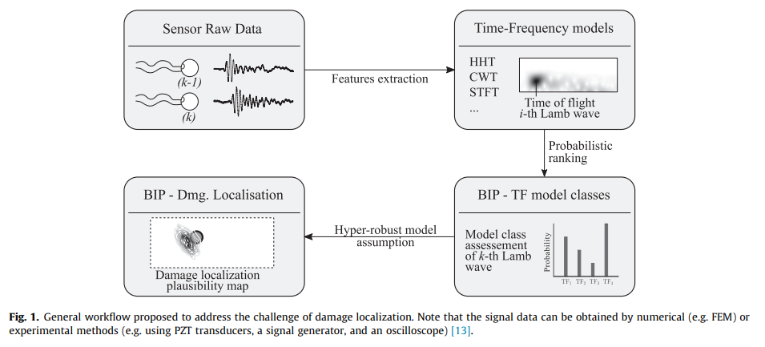
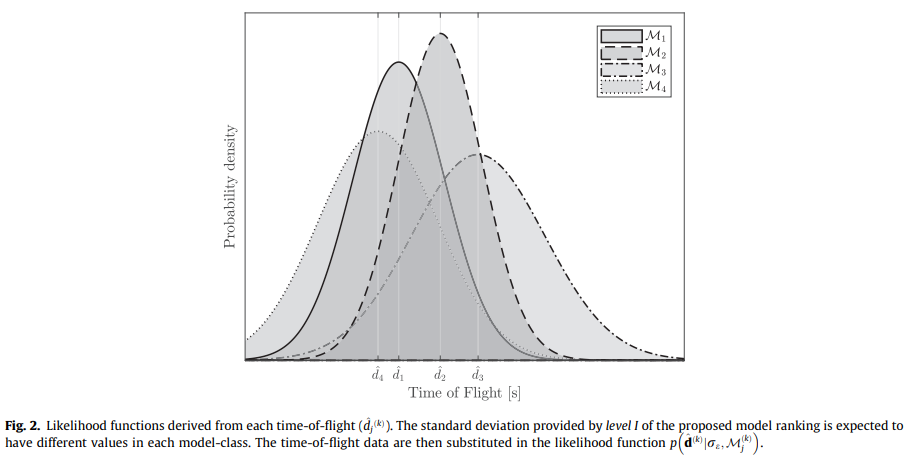
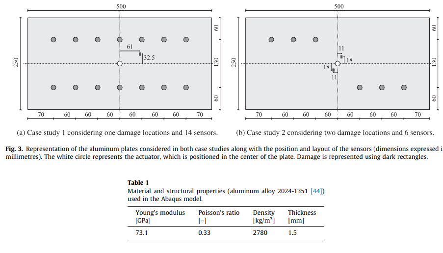
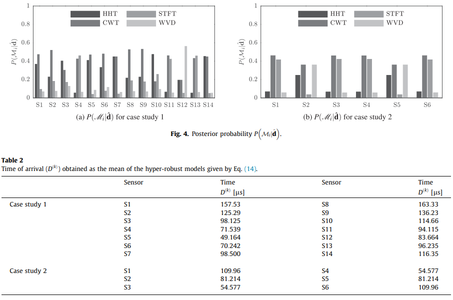
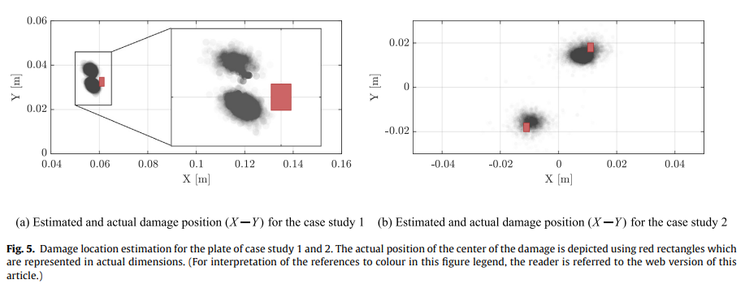
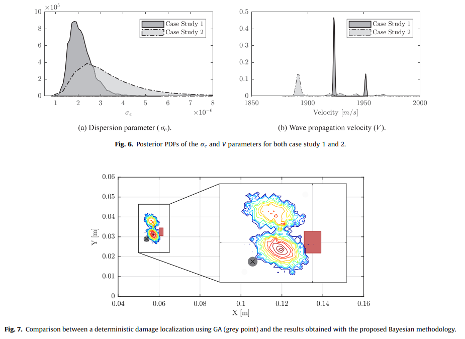
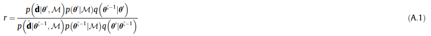

# A robust Bayesian methodology for damage localization in plate-like structures using ultrasonic guided-waves

一种使用超声导波在板状结构中进行损伤定位的稳健贝叶斯方法

[TOC]

## 摘要 Abstract

用于板状结构的损伤检测与定位的SHM方法通常依赖于超声导波的信号后处理技术。飞行时间作为这些信号特征之一，已经被SHM社区广泛的应用于损伤定位。一种获得飞行时间的方法是通过应用特定的时频转换来捕获波在每个时刻的频率和能量(的含量)。为此，在文献中很多研究者为时频转换选择一个合适的方法通常依赖于经验，或者仅仅是基于对计算效率的考虑。在本文中，提出了一种基于贝叶斯逆问题的全概率方法，以严格独立地为每个传感器提供飞行时间的稳健估计。然后，引入稳健预测作为损伤定位的贝叶斯逆问题的输入。结果表明，所提出的方法能够有效地重建金属板内的损伤定位，而无需假设特定的先验时频变换模型。

## 1. 介绍 Introduction

使用基于导波的 SHM 在板状结构中的损伤重建和定位主要是使用应用于超声波信号的后处理技术来解决的 [^1]。探索具有小衰减的大区域 [^2] 是导致航空航天工业等行业关注导波的最显着特征之一 (例如“PAMELA”系统 [^3] [^4] [^5] )。现在也有其他使用基于声学的 SHM 方法来定位薄壁结构损伤的方法。这些可以大致分为 (1) 无源传感诊断技术 (PSD) 和 (2) 有源传感诊断技术 (ASD)。与基于“收听模式” (例如声发射) [^6] [^7] [^8] [^9] [^10] [^11] [^12] 的传感器的 PSD 技术相比，用于板状结构的 ASD 技术会发射与结构相互作用并由传感器测量的超声波 [^13]。放置稀疏或相控阵传感器的布局，以便根据需要主动询问结构，从而提供更高的准确性和可靠性[^14]。在基于条件的维护中，潜在的安全和经济意义是使用这种SHM技术的额外动机。

此外，对提供准确健康指标的自主技术的需求对航空航天结构尤为重要，因为这些结构基于大量需要需要频繁检查的关键结构部件。一旦检测到损坏区域，即通过分析损坏容限超出范围，就可以做出适当的操作决策。损伤检测通常采用两种通用方法: (1) 基于模型的逆问题，从而可以从测量信号中以相当大的计算成本获得详细的损伤信息 (例如，损坏的严重程度作为剩余强度) [^15]；(2) 基于后处理信号特征的逆问题，从而可以更有效地获取其他相关信息，例如损坏位置或损坏严重程度。关于第二种方法，文献中描述了几种损伤重建技术 [^2] [^16] [^17] [^18] 。其中，飞行时间 (ToF) 已被广泛用作一种信号特征，因为它可以有效地获取有关材料特性的信息以及随后处理散射信号进行损伤定位。

时频 (TF) 表示技术已被广泛用于提取 ToF 作为信号特征。通过 TF 表示，可以在每个时刻获得频域频谱 [^19]，但是根据文献中可用的各种方法，彼此的结果略有不同。其中，Hilbert-Huang 变换 (HHT)、连续小波变换 (CWT)、短时傅里叶变换 (STFT) 和 Wigner-Ville 分布 (WVD) [^19] [^20] [^21] [^22] 是基于超声导波的 SHM 应用中最常用的一些技术 [^23] [^24] [^25]。通常，根据建模者的经验或基于特定的 TF 分辨率特征，从可用选项中选择一个。然而，由于模型假设和假设各不相同，选择不合适的模型可能会导致损害识别有偏差 [^26] [^27]。换句话说，选择特定的 TF 方法而不是另一种方法受认知不确定性的影响(例如，缺少知识)。此外，基于超声波的损伤定位还传达了其他不确定性来源，这些不确定性主要与测量系统和材料的物理特性有关。如果在计算中没有适当考虑和量化这些不确定性，它们可能会产生不可靠的损坏预测。

为了部分解决这个建模问题，许多研究人员提出了使用基于概率的方法 [^28] [^29] [^30]。其中，应用于基于超声的损伤定位的贝叶斯逆问题（BIP）在 SHM 社区中越来越受到关注，尽管它仍处于早期阶段。在 [^24] 中，BIP 被成功地证明可以定位铝板的损伤区域。最近，在 [^23] 中提出了一种用于解释复合层压板的群速度各向异性的 BIP 方法。尽管如此，仍然明显的需要严格处理使用基于超声导波的方法来应对损伤定位进行建模时的不确定性，总体而言，当预计会有多个损伤位置时。

本文提出了一个多层次的贝叶斯框架，以严格解释应用兰姆波基于超声的损伤定位问题的整体不确定性。首先，基于后验概率的给定实验配置解决了 TF 模型选择问题，后验概率评估特定模型在一组候选上的相对置信度 [^31]；然后，使用基于信号特征的 BIP 进行损伤识别和定位问题，该模型采用来自第一评估级别的超稳健 TF 模型。为此，一旦获取了原始数据，就会为每个压电 (PZT) 传感器分层制定两个 BIP，以便将模型选择问题的结果用作损伤定位的输入，如图 1 所示。在这个框架中，由于海森堡原理 [^19] [^30]，来自 (1) 材料的机械性能、(2) 测量误差和 (3) TF 模型中的海森堡原理造成的认知不确定性的不确定性被考虑在内。所提出的方法依赖于模型类选择的严格概率逻辑假设 [^32]，因此，它避免了基于经验的关于最佳后处理技术的决策。在这里，概率被解释为一种多值逻辑，它表示以给定信息为条件的命题的可信度 [^33] [^32]。该方法应用于两个案例研究，分别使用具有一个和两个损坏区域的铝板。针对损伤定位的特殊问题，采用渐近独立马尔可夫采样 (AIMS) [^34,35] 算法来解决由此产生的贝叶斯逆问题，在处理损伤多模态方面表现出较高的效率。总的来说，结果显示了所提出的方法在使用导波重建板状结构中的损伤位置方面的高效性，同时严格考虑了重建中的建模不确定性。

在本文的其余部分安排如下：第 2 节展示了模型选择问题中使用的 TF 模型。第 3 节包含用于获得每个传感器的 ToF 的稳健估计的概率方法。第 4 节介绍了用于获得损伤定位的 BIP 原理。第 5 节中提出的框架应用于两个案例研究以作为示例。第 6 节讨论了所提出方法的稳健性。最后，第 7 节提供了结论性意见。

## 2. 时频模型 Time-frequency models

本文选择了4个在文献中最常用的 TF 模型，使用所提出的贝叶斯方法对每个传感器独立进行评估和排序； 即 HHT、CWT、STFT 和 WVD。这些 TF 表示技术的主要公式显示在如下小节中。

### 2.1 希尔伯特-黄变换 Hilbert-Huang transform

HHT 是通过固有模式函数 (IMF) 的总和获得的，由此在对每个 IMF 分量执行 Hilber 变换后定义频谱 [^20] [^26]，如下所示：

$$
g_{i}\left( t\right) =\sum ^{n}_{j=1}\alpha _{j}\left( t\right) \exp \left( i\int \omega _{j}\left( t\right) dt\right) 
\tag{1}
$$

其中 $ \alpha _{j}\left( t\right) $ 是解析信号的幅度，通常被认为是输入时间序列的包络或直接被传感器获取的信号，$ n $ 是数字 IMF 分量，$ \omega _{j}\left( t\right) $ 是瞬时频率。方程 (1) 表示作为时间函数的幅度和瞬时频率。

### 2.2 连续小波变换 Continuous wavelet transform

TF 小波在 CWT 中用于获得评估信号的 TF 表示，方法是：

$$
g_{2}\left( b,a\right) =\dfrac{1}{\sqrt{a}}\int ^{\infty }_{-\infty }X\left( t\right) \overline{\Psi \left( \dfrac{t-b}{a}\right) dt}
\tag{2}
$$

其中 $ X\left( t\right) $ 表示信号的时间序列， $ \Psi \left( t\right) $ 表示分析小波， $ a > 0 $ 是缩放因子， $ b $ 是时移因子，上划线表示复共轭 [^21] [^36]。使用该模型获得了显着的时间和频率分辨率。 

### 2.3 短时傅里叶变换 Short-time Fourier transform

或者，可以使用 STFT 表示 TF，该 STFT 对评估信号中的移动窗口执行傅里叶变换 [^19] [^37]，如下所示：

$$
g_{3}\left( \omega ,t\right) =\dfrac{1}{2\pi }\int _{-\infty }^{\infty }e^{-i\omega t}X\left( \tau \right) h\left( \tau -t\right) d\tau
\tag{3}
$$

其中 $ X\left( t\right) $ 是时间序列， $ h\left( t\right) $ 是窗口函数， $ \omega $ 表示频率。STFT 的能谱称为谱图。

### 2.4 维格纳-维尔分布 Wigner-Ville distribution

WVD 可以解释为信号本地时频能量的量度 [^37]，其定义如下：

$$
g_{4}\left( \omega ,t\right) =\int _{-\infty }^{\infty }X\left( t+\dfrac{\tau }{2}\right) \overline{X\left( t-\dfrac{\tau }{2}\right) }e^{-i\omega t}d\tau
\tag{4}
$$

其中 $ X\left( t\right) $ 是时间序列，上划线表示复共轭。 这种技术在检测和定位狄拉克脉冲和正弦曲线方面非常有效 [^19] [^37]。

##  3. 贝叶斯模型类排名 Bayesian model class ranking

第 2 节中的 TF 模型只是基于许多简化假设和建模假设的不同可选方案以表示现实中的相同情况。相反，对于特定模型，这种简化假设的有效性取决于某些模型参数的采用值 (例如色散参数)。因此，为了同时识别每个 TF 模型的合理性和更适合来自原始超声数据的信息的模型参数值，提出了贝叶斯逆问题 (BIP)。给定通过一组 PZT 传感器监控的板状结构，由于传感器之间的电位差异，例如不同的工作环境或制造缺陷，BIP 将针对每个 PZT 传感器单独处理。

###  3.1 TF 模型的随机嵌入 Stochastic embedding of TF models

让我们考虑一个由关系 $ g_{j} $ 定义的候选 TF 模型： $ \mathbb{R}^{n} \to \mathbb{R} $ 在离散信号 $ \mathcal{D}^{(k )} \in \mathbb{R}^{n} $ 作为输入和模型输出 $ g_{j} \in \mathbb{R}^{n} $，其中 k 表示结构中的第 k 个传感器 . 接下来，令$ \widehat{d}^{(k)}_{j} $ 为散射超声信号中观察到的第一个能量峰值，使得$ \widehat{d}^{(k)}_{j} = g_{j}(\mathcal{D}^{(k)}) $. 假设 $ g_{j} $ 只是一组备选方案 [^32] 上的候选模型（例如，如第 2 节中描述的那些），那么测量的第一个峰值，这里表示为 $ \widetilde{d}^ {(k)} $，将更严格地表示为不确定变量，如下所示：

$$
\widehat{d}^{(k)}_{j} = g_{j}(\mathcal{D}^{(k)}) + \varepsilon
\tag{5}
$$

其中 $ \varepsilon $ 是一个不确定的误差项，它解释了 $ \widehat{d}^{(k)}_{j} $ 和 $ \widetilde{d}^ {(k)} $ 之间的差异，即分别为第一个能量峰值的建模和测量值。 遵循最大信息熵原理（PMIE）[^32][^33]，可以保守地假设这个误差被建模为标准差为$\sigma_{\varepsilon}$的零均值高斯分布，即$ \sigma \sim \mathcal{N}(0, \sigma_{\varepsilon}) $. PMIE 能够以合理的方式为模型误差项建立概率模型，使其产生最大的不确定性（最大的香农熵）； 选择任何其他概率模型都会导致这种不确定性的不合理减少 [^32]。 因此，遵循等式(5)，TF模型的概率描述可以得到：

$$
p(\widetilde{d}^ {(k)} | \mathcal{M}^{(k)}_j, \sigma_{\varepsilon}) = (2\pi \sigma^{2}_{\varepsilon})^{-\frac{1}{2}}exp(-\frac{1}{2}(\frac{\widetilde{d}^ {(k)} - g^{-1}_{j}(\mathcal{D}^{(k)})}{\sigma_{\varepsilon}})^{2})
\tag{6}
$$

其中 $ \mathcal{M}^{(k)}_j $ 表示一组 $ N_m $ 个可用 TF 模型中的第 j 个候选模型类 $ \mathbf{M} = {\mathcal{M}^{(k )}_1,...,\mathcal{M}^{(k)}_j,...,\mathcal{M}^{(k)}_{N_m}}$。 每个模型类由方程给出的随机 TF 模型定义。等式(6) 连同模型参数 $\sigma_{\varepsilon} $ 的先验概率密度函数 (PDF)，$ p(\sigma_{\varepsilon} | \mathcal{M}^{(k)}_j)$。 该先验 PDF 表示在通过贝叶斯更新合并来自测量的信息之前，在一组可能值 $ \Theta \subseteq \mathbb{R} $ 中的值的初始置信度，如 下面进一步解释。 对于结构中的所有传感器，随机模型是独立定义的，因此考虑了不同的潜在误差和不确定性来源。

### 3.2 模型参数估计 Model parameters estimation

此前为了从测量中获取模型参数更新，对离散参数 $\sigma_{\varepsilon}$ 在模型类评估和排序中的影响进行了初步评估，结果表明模型类评估结果对该参数的值具有较高的敏感性 . 因此，BIP 的第一阶段被设想为在给定一组数据 $ \widehat{\boldsymbol{d}}^{(k)} = { {\widehat{d}}^{(k)}_{1},...,{\widehat{d}}^{(k)}_{N_{m}}} $，对应一个集合 通过采用每个 TF 模型类获得的 $N_m$ 个值。 为此，离散度的后验 PDF $p(\sigma_{\varepsilon} | \widehat{\boldsymbol{d}}^{(k)},\mathcal{M}^{(k)}_j)$ 参数 $\sigma_{\varepsilon} $ 给定第 j 个 TF 模型类 $ (\mathcal{M}^{(k)_j}) $，是必需的。 因此，通过使用贝叶斯定理，这个后验概率密度函数由下式给出：

$$
p(\sigma_{\varepsilon} | \widehat{\boldsymbol{d}}^{(k)},\mathcal{M}^{(k)}_j) = c^{-1}p(\widehat{\boldsymbol{d}}^{(k)} | \sigma_{\varepsilon},\mathcal{M}^{(k)}_j)p(\sigma_{\varepsilon} | \mathcal{M}^{(k)}_j)
\tag{7}
$$

其中 $ c $ 是一个归一化常数，因此：

$$
\int_{\Theta}p(\sigma_{\varepsilon} | \widehat{\boldsymbol{d}}^{(k)},\mathcal{M}^{(k)}_j)d\sigma_{\varepsilon} = \int_{\Theta} c^{-1}p(\widehat{\boldsymbol{d}}^{(k)} | \sigma_{\varepsilon},\mathcal{M}^{(k)}_j)p(\sigma_{\varepsilon} | \mathcal{M}^{(k)}_j)d\sigma_{\varepsilon} = 1
\tag{8}
$$

在等式 (7), $ p(\sigma_{\varepsilon} | \mathcal{M}^{(k)}_j) $ 是似然函数，表示数据 $ \widehat{\boldsymbol{d}}^ {(k)} $ 的可能性有多大由方程中的随机模型再现。 (6) 如果采用模型类$\widehat{\boldsymbol{d}}^{(k)}$，如图2所示。这个似然函数可以通过$\widehat{\boldsymbol{d}}^{(k)}$的值代入得到作为随机模型的输出，如下：

$$
p(\sigma_{\varepsilon} | \mathcal{M}^{(k)}_j) = \prod^{N_m}_{\ell=1} p(\widehat{d}^{(k)}_{\ell} | \sigma_{\varepsilon}, \mathcal{M}^{(k)}_j)
\tag{9}
$$

因此，等式(7) 改写为：

$$
p(\sigma_{\varepsilon} | \widehat{\boldsymbol{d}}^{(k)},\mathcal{M}^{(k)}_j) \propto 	\left\{{\prod^{N_m}_{\ell=1} p(\widehat{d}^{(k)}_{\ell} | \sigma_{\varepsilon}, \mathcal{M}^{(k)}_j)}\right\}p(\sigma_{\varepsilon} | \mathcal{M}^{(k)}_j)
\tag{10}
$$

此外，观察到对等式中的归一化常数 $ c $ 的评估。等式(7)通常不能进行分析评估，除非基于线性模型和高斯不确定性的特殊情况[^38]。 然而，基于 MCMC 方法 [^39][^40] 的随机模拟可用于从后验中获取样本，避免评估 $ c $，如下一节所示。

## 3.3 模型类评估 Model class assessment

模型类评估的概率方法是基于 TF 模型的不确定性，该模型基于其公式 [^32][^33] 所采用的假设假设和简化。 一旦得到后验 $ p(\sigma_{\varepsilon} | \widehat{\boldsymbol{d}}^{(k)},\mathcal{M}^{(k)}_j) $，则 模型类 $ \mathcal{M}^{(k)}_j $ 可以通过应用总概率定理获得：

$$
P(\mathcal{M}^{(k)}_j | \widehat{\boldsymbol{d}}^{(k)}) = \int_{\Theta}P(\mathcal{M}^{(k)}_j | \widehat{\boldsymbol{d}}^{(k)}, \sigma_{\varepsilon})p(\sigma_{\varepsilon} | \widehat{\boldsymbol{d}}^{(k)})d\sigma_{\varepsilon}
= \int_{\Theta} \frac{p(\widehat{d}^ {(k)} | \mathcal{M}^{(k)}_j, \sigma_{\varepsilon})P(\mathcal{M}^{(k)}_j)}{\begin{matrix} \sum_{\ell=1}^{N_m} p(\widehat{d}^ {(k)} | \mathcal{M}^{(k)}_j, \sigma_{\varepsilon})P(\mathcal{M}^{(k)}_j) \end{matrix}}p(\sigma_{\varepsilon} | \widehat{\boldsymbol{d}}^{(k)})d\sigma_{\varepsilon}
\tag{11}
$$

其中 $ p(\sigma_{\varepsilon} | \widehat{\boldsymbol{d}}^{(k)}) $ 表示由等式获得的后验概率密度函数。等式(10),(11)可以通过应用渐近拉普拉斯近似 [^32] 简化如下：

$$
P(\mathcal{M}^{(k)}_j | \widehat{\boldsymbol{d}}^{(k)}) = \frac{p(\widehat{d}^ {(k)} | \mathcal{M}^{(k)}_j, \sigma_{\varepsilon})P(\mathcal{M}^{(k)}_j)}{\begin{matrix} \sum_{\ell=1}^{N_m} p(\widehat{d}^ {(k)} | \mathcal{M}^{(k)}_j, \sigma_{\varepsilon})P(\mathcal{M}^{(k)}_j) \end{matrix}}
\tag{12}
$$

其中 $\mathbf{M}$ 的条件为简单起见被抑制，$\sigma_{M_j}$ 是后验 PDF $p(\sigma_{\varepsilon}|\widehat{\boldsymbol{d}}^{(k)},\mathcal{M}^{(k)}_j)$的最大后验 (MAP) 值，即：

$$
\sigma_{M}=arg_{\sigma_\varepsilon}max\;p(\sigma_{\varepsilon}|\widehat{\boldsymbol{d}}^{(k)},\mathcal{M}^{(k)}_j)
\tag{13}
$$

### 3.4 超稳健模型估计 Hyper-robust model estimation

上面获得的模型类 $\mathcal{M}^{(k)}_j$ 的基于概率的排名提供了有关每个传感器的第 j 个 TF 模型类的置信度的信息。 然而，提出了一个超鲁棒模型 [^32] 来解释所有模型类所持有的不确定性，从而为解决模型类选择提供了一个严格的工具。 特定传感器 k 的超稳健模型定义为每个 TF 模型的加权平均值，如下所示：

其中 $\widetilde{d}^{(k)}$ 是可能的 ToF 值，$w^{(k)}_{\ell}$ 是权重，由第 l 个模型类的后验概率给出 $P(\mathcal{M}^{(k)}_j | \widehat{\boldsymbol{d}}^{(k)})$。 假设每个随机模型都分布为高斯函数，方程式中还提供了超稳健高斯分布的简化表达式。 (14)。 然而，为了解决损伤定位问题，使用随机模型作为输入数据需要大量的计算工作。 相反，采用第 k 个传感器中超鲁棒模型的平均值，表示为 $D^{(k)}$。

## 4. 贝叶斯损伤定位 Bayesian damage localization

### 4.1 ToF模型的概率描述 Probabilistic description of ToF model

在本节中，损伤定位通过基于模型的 BIP 使用基于椭圆的 ToF 模型 [^28] 来解决，该模型已广泛用于基于导波的 SHM 中的损伤定位。 对于这个问题，Np 致动器-传感器路径被考虑在一个板状结构中，以通过筛选其 ToF 的变化来激发和接收 Lamb 波以进行损伤定位。 为此，理论上可以得到散射信号的ToF信息如下[^41]：

$$
ToF^{(a-s)} = \frac{\sqrt{(X_d-X_a)^2+(Y_d-Y_a)^2}}{V_{a-d}}+ \frac{\sqrt{(X_d-X_s)^2+(Y_d-Y_s)^2}}{V_{d-s}}
\tag{15}
$$

其中 $(X_d,Y_d)$ 是损坏的坐标，$(X_a,Y_a)$ 是执行器传感器坐标，$(X_s,Y_s)$ 是一个任意传感器传感器的坐标，$V_{ad} $ 和 $V_{ds}$ 分别是执行器损坏和损坏传感器路径的波传播速度。 这些速度在假设各向同性材料和有界区域内的集中损伤下是相同的，即 $V=V_{ad}=V_{ds}$ 或者，在考虑正交各向异性材料（例如复合结构）下 项将取决于致动器损坏和损坏传感器路径的角度，$V_{ad}(\alpha_a)$ 和 $V_{ds}(\alpha_a)$ 分别为 [^23]。

概率性地描述方程 (15) 给出的 ToF 模型，需要考虑来自数据、材料特性以及模型本身的不确定性。 为此，在该问题中考虑了一组不确定的模型参数$\mathbf{m}=\left\{X_d,Y_d,V\right\}$来描述损伤坐标的不确定性以及 波传播速度。 模型参数集合 $\mathbf{m}$ 增加了模型误差项 $\mathscr{e}\in\mathbb{R}$ ，从而得到一组定义为 $\theta=\left\{\mathbf{m},\sigma_e\right\}=\left\{X_d,Y_d,V,\sigma_e\right\}\in=\Theta$的模型参数 ，其中 $\sigma_e$ 是误差项 $e$ 的标准差，$\Theta$ 是模型参数空间。 这组参数通过贝叶斯定理进一步更新，如下所述。 所引用的模型误差项 $\mathscr{e}\in\mathbb{R}$ 被认为是不存在完全代表现实的理论 ToF 模型的原因，因此：

$$
ToF^{(a-s)}_\mathcal{D}=ToF^{(a-s)}_M(\mathbf{m})+e=ToF^{(a-s)}_M(\theta)
\tag{16}
$$

其中来自 $ToF^{(a-s)}_\mathcal{D}$ 和 $ToF^{(a-s)}_M(\mathbf{m})$ 的下标 $M$ 和 $\mathcal{D}$ 指代建模 并分别测量 ToF。 注意等式 (16) 提供了 $ToF^{(a-s)}_M(\mathbf{m})$ 值之间的差异。 通过 PMIE，这个误差项可以保守地描述为具有协方差 $\sigma_e$, $\mathcal{N}(0, \sigma_{\varepsilon})$ 的零均值高斯分布。 因此，来自方程式 (16) 的 ToF 模型的概率描述可以得到：

$$
ToF^{(a-s)}_\mathcal{D}=ToF^{(a-s)}_M(\mathbf{m})+e=ToF^{(a-s)}_M(\theta)
\tag{17}
$$

观察等式  (17) 提供了对建模和测量的 ToF 的相似性的测量。 另外，请注意等式 (17) 为 $ToF^{(a-s)}_M(\mathbf{m})$ 模型下的 $ToF^{(a-s)}_\mathcal{D}$ 数据提供了似然函数。

### 4.2 模型参数估计 Model parameter estimation

给定等式(17)中的似然函数给定ToF数据 $\mathbf{D}=\left\{D^1,...,D^{(N)}\right\}$，可以获得模型参数的后验PDF， 其中 N 是通过应用众所周知的贝叶斯定理得出的传感器总数：

$$
p(\theta|\mathbf{D})= \frac{p(\mathbf{D}|\theta)p(\theta)}{p(\mathbf{D})}
\tag{18}
$$

其中 $p(\theta)$ 是模型参数的先验 PDF，$p(\mathbf{D}|\theta)$ 是数据集 $\mathbf{D}$ 的似然函数。 给定测量的随机独立性，似然可以表示为 $p(\mathbf{D}|\theta)=\begin{matrix} \prod_{k=1}^N p(D^{(k)}| \theta) \end{matrix}$，其中每个因子 $p(D^{(k)|\theta})$ 由等式(17)给出。 最后，$p(\mathbf{D})$ 是 $\theta$ 指定的模型下数据的证据。 该术语在贝叶斯定理中充当归一化因子，可以通过采样绕过，例如 使用马尔可夫链蒙特卡罗 (MCMC) 方法 [^42]。 因此，等式 (18) 可改写为：

$$
p(\theta|\mathbf{D})\propto\left\{\prod_{k=1}^N p(D^{(k)}| \theta)\right\}p(\theta)
\tag{19}
$$

### 4.3 渐近独立马尔可夫采样算法 Asymptotic independence Markov sampling algorithm

在实践中，板状结构中可能存在多个损伤位置，因此用于获取此类潜在损伤位置的后验概率分布函数的更新算法应该能够提供多模态概率分布函数的样本。在文献中，大多数可用的 MCMC 算法可以以增加计算负担为代价来识别多模态后验概率密度函数，如果探索大维参数空间，或者通过引入临时算法修改 [^43]，这种情况可能会加剧。为了克服这个缺点，这里使用渐近独立马尔可夫采样 (AIMS) 算法 [^34]，因为它可以高效地提供来自多模态后验 PDF 的样本。在 AIMS 算法中，后验 PDF $p(\cdot)$ 使用三种众所周知的随机模拟方法的组合来近似。为此，模拟退火用于通过随机游走 M-H 对中间分布 $p_j(\cdot)$ 进行采样，从先验分布中获得目标分布 $p(\cdot)$。中间分布 $p(\cdot)$ 通过使用重要性采样来近似。算法 1 提供了 AIMS 方法的伪代码实现。

## 5. 实例探究 Case studies

在本节中，提出了两个案例研究，以使用一组由有限元建模 (FEM) 综合生成的导波来验证所提出的模型类别选择方法。 该方法应用于分别考虑一个和两个受损区域的损伤检测和定位的两种情况。

### 5.1 合成信号生成 Synthetic signal generation

为了以数值方式生成输入信号，使用 Abaqus 对 Lamb 波进行建模以进行模拟。 如图 3 所示（参见表 1 中关于铝合金 2024-T351 的更多特性），在尺寸为 0:5 m x 0:25 m 的铝基合金 2024-T351 制成的薄板上产生波。 在图 3（面板 (a)）中，传感器编号从最左上传感器的 S1 到最右下传感器的 S14 建立。 在面板 (b) 中，对应于两个损坏位置的情况，传感器从 S1 到 S6 类似地排列。 对于 ToF 计算，在这项工作中使用 Abaqus/Explicit 模块，因为它可以有效地模拟超声波导波的瞬态行为。

一个 4 节点、四边形、应力-位移壳单元，具有减少的积分和大应变公式，称为 S4R 单元 [^45]，用于板模型，使用 1 mm 大小的方形单元进行均匀网格化。单元尺寸由所表示的导波模式的最小波长$\lambda_{min}$ 决定。通常每个波长至少需要 10 个节点，以确保避免空间混叠 [^46]。信号激励被建模为一个垂直点力，它生成为以频率 $f=100kHz$ 为中心的 5 个周期的正弦脉冲突发。选择该频率是为了避免由于可能出现的高阶导波模式而导致信号后处理的额外复杂性。当频率保持在相对较低的值时，只有反对称 0 (A0) 和对称 0 (S0) 模式都被激发 [^46]。假设模型捕获的模式的波传播速度约为$V=1950m/s$，则最大单元尺寸为$\lambda/10=(V/f)/10=1.95mm$。但是，请注意，所选元素尺寸 (1 mm) 几乎是最大值的一半。接下来，对于本文中考虑的两个案例研究，损伤被建模为尺寸为 2 mm x 4 mm 的矩形孔。在这两种情况下都考虑了自由边界条件。然后在未损坏和损坏的情况下，传感器都会接收超声波信号。然后，减去来自两种状态的信号，从而获得来自损伤的散射信息，如 4.1 节所述。

### 5.2 选型结果 Model selection results

如前所述，板对兰姆波的模拟响应被用作贝叶斯框架内的数据。首先，标准差参数$\sigma_\varepsilon$被定义为$\sigma_\varepsilon=\rho\cdot\widehat{\boldsymbol{d}}^{(k)_j}$，其中$\widehat{\boldsymbol {d}}^{(k)_j}$ 是使用第 j 个 TF 模型到达第 k 个传感器的时间，$\rho$ 是在足够大的间隔内定义的因子，在本例中取为 $(0,0.5]$ 因此，$\sigma_\varepsilon$ 的先验 PDF 可以表示为在所指区间上的均匀分布。后验 PDF $p(\sigma_{\varepsilon}|\mathcal{ M}^{(k)}_j),\widehat{\boldsymbol{d}}^{(k)}$ 是通过使用 Metropolis-Hasting (M-H) 算法的样本获得的（参见附录 A 中的伪代码实现） $T_s=40,000$ 和高斯建议分布，即 $q(\theta'|\theta)=\mathcal{N}(\theta,\sigma)$，其中 $\sigma$ 为 $[0.2,0.4] $[^47][^48][^49]. 然后计算最大后验 (MAP) 参数并将其作为模型类选择问题的输入引入，如第 1 节所述3.3.

从方程 (12) 得到的后验概率，随后用于对每个候选 TF 模型进行排名，如图 1 和图 2 所示。图 4a 和 b 分别用于案例研究 1 和 2。从这些结果中可以看出，对于所有传感器来说，并没有一个特别占主导地位的 TF 模型。尽管如此，对于绝大多数传感器来说，CWT 模型似乎是最合理的模型，即案例研究 1 的 14 个传感器中有 8 个，案例研究 2 的 6 个传感器中有 4 个。因此，如果单个 TF 模型具有要选择损伤识别，基于这些结果的合理选择将是选择 CWT 模型，因为这种选择可以更好地表示大多数传感器的给定数据。该输出与文献中大多数选择 CWT 模型从散射信号 [^23][^24] 中获取 ToF 的作者一致。尽管如此，可以通过应用等式 (14) 获得超稳健模型使用每个模型类的后验概率。在这种情况下，ToF 是通过每个传感器的概率模型的模型平均值获得的，如表 2 所示。这些值随后用于重建损伤定位的 BIP 中的损伤，如下所示。

###  5.3 损伤定位与重建 Damage localization and reconstruction

一旦对 TF 模型进行排序并获得超鲁棒 TF 模型，每个传感器的每个超鲁棒模型的平均值将用作损伤定位的 BIP 中的 ToF 数据 $\mathbf{D}$，在第4. 模型参数的先验信息已被定义为损伤位置和分散参数（$X\sim\mathcal{U}(-0.25,0.25)m$, and $Y\sim\mathcal{ U}(-0.125,0.125)m$ 和 $\sigma_\varepsilon\sim\mathcal{U}(0,10^{-4})$)，以及速度的高斯 PDF $V\sim\mathcal  {N}(v,\sigma_v)$，其中 $v=1950m/s$ 和 $\sigma_v=40m/s$。在这种情况下，使用 AIMS 算法得到模型参数 $\theta$ 的后验 PDF，每个退火级别的阈值 $\gamma=1/2,10^5$ 个样本，并以高斯 PDF 作为提议分布，即$q(\theta'|\theta)=\mathcal{N}(\theta,\sigma)$，其中 $\theta$ 是 M-H 随机游走的标准偏差，它再次被选择，使得接受率 r 位于在区间 $[0.2,0.4]$ 内。图 5 分别显示了案例研究 1 和 2 的铝板的推断损伤位置，使用由方程(14)获得的超鲁棒 TF 模型。通过使用 TF 模型的后验似然性进行加权的模型平均，为每个传感器获得超鲁棒模型，如图 4 所示。可以观察到，使用本文提出的 BIP 方法可以有效地重建损伤位置。结果还表明，对于特定案例研究 2，使用 AIMS 算法可以很好地解决由双重损伤位置引起的多模态问题。

损伤定位 BIP 使用的其他两个参数的边际后验分布，即似然函数 $\sigma_\varepsilon$ 的标准偏差因子和波传播速度 $V$，如图 6 所示。 在研究 1 中，观察到两个参数 $\sigma_\varepsilon$ 和 $V$ 的离散度较低，而在案例研究 2 中，获得了较高的离散度。

## 6. 讨论 Discussion

提出的用于损伤定位的贝叶斯方法已使用第 5 节中介绍的两个案例研究进行了举例说明。对于每个传感器，提出了一个贝叶斯模型类评估框架来根据测量相对程度的相对合理性对候选 TF 模型进行排名。候选模型类在解释传感器获取的原始信号方面的信念。然后使用这些相对合理性为每个传感器获得一个超鲁棒的 TF 模型，与仅在候选集中采用最合理的 TF 模型相比，这为损伤定位提供了更高水平的鲁棒性。这种鲁棒性在图 5a 中清楚地体现出来，其中在靠近实际损坏位置的两个合理区域中确定了损坏位置；由于未考虑模型的不确定性，不合理的 TF 模型选择会导致有偏差的定位。对于波传播速度参数的重建，在图 6b 中也可以观察到相同的行为。请注意，两个案例研究中使用的超声波数据都是通过 FEM 综合获得的，尽管该方法完全适用于真实的超声波信号。然而，对于真实的超声波数据，由于电子噪声或其他测量误差，例如传感器粘合不完善，损伤定位的不确定性会更高。

然后，使用基于椭圆模型的损伤定位 BIP 应用 AIMS 算法作为贝叶斯更新算法重建损伤位置。数据 D 是通过使用由方程式给出的超稳健模型的平均值获得的。 (14) 每个传感器独立。在这两个案例研究中，损坏的位置都得到了显着的推断。然而，与案例研究 1 相比，在案例研究 2 中发现了更高的 X Y 参数离散度（更大的定位不确定性），如图 5 所示。此外，在边缘分布中发现了更高的离散度案例研究 2 中的标准差参数 $\sigma_\varepsilon$。这可以解释为来自等式 (17)的似然函数的性质，这是一个高斯分布。为了正确识别本案例研究中的两个损伤位置，$\sigma_\varepsilon$（这是一个可更新参数）的后验值需要增加，从而导致损伤定位和速度参数重建，如图 6 所示。这指出了所提出的方法在处理多个损坏位置时的局限性。在这种情况下，一个理想的进一步工作将是探索最优似然函数来处理损伤多模态。

最后，值得一提的是，传感器的位置在损伤重建中起着至关重要的作用。 如图 3 所示，案例研究 1 和 2 具有不同的传感器选择和布局。 在本文中，对传感器位置进行了先前的敏感性研究，以确定：（1）每个案例研究的最佳传感器数量和（2）传感器位置。 因此，鉴于上述两个因素在损伤位置重建中的影响，下一步的工作将是探索一种有效的方法来优化传感器配置，基于严格的概率假设来处理上述不确定性来源。

## 7. 结论 Conclusions

本文介绍了一种使用导波进行损伤定位的贝叶斯方法。 这种方法可以考虑多种不确定性来源，例如由于 TF 模型选择导致的认知不确定性，以及来自测量噪声和可变材料特性的不确定性。 该方法的有效性通过两个案例研究分别显示了一个和两个受损区域。 从本文得出以下结论：

- 使用ToF可以准确地重建损坏位置，证明了所提出的多级贝叶斯逆问题方法的有效性；
- 使用超鲁棒 TF 模型作为损伤定位贝叶斯逆问题的输入导致更鲁棒的损伤推断；
- 案例研究 2（多模态）中两个损伤区域的重建已通过使用 AIMS 算法得到显着解决。 然而，在这种损坏情况下，模型参数的后验不确定性显着增加。

关于以下方面的进一步研究工作正在考虑中：(1) 评估合适的似然函数以有效处理多模态损伤场景，(2) 设计一种严格的技术，用于在基于超声波导波的 SHM 中优化传感器配置，以及 (3) 不同类型的损害对建议方法的性能的影响。

## Appendix A. 基于贝叶斯更新的 MH 模拟 Metropolis-Hastings simulation for Bayesian updating

M-H算法从一个特殊构造的马尔可夫链生成样本，其平稳分布是所需的后验PDF $p(\theta|\hat{\boldsymbol{d}},\mathcal{M})$，通过对候选模型参数$进行采样 \theta'$ 从提议分布 $q(\theta'|\theta^\xi)$ 中，M-H 在 $\xi+1$ 处获得链的状态，给定 $\xi$ 处的状态，由 $\theta^\xi$。 候选参数 $\theta'$ 以 $min\left\{1,r\right\}$ 的概率被接受（即$\theta'=\theta^\xi$），并拒绝（即$\theta ^{\xi+1}=\theta^\xi$)，剩余概率为 $1-min\left\{1,r\right\}$，其中：

重复该过程，直到生成了 $T_s$ 个样本，以便监控的接受率（接受的 M-H 样本与样本总数之间的比率）达到渐近行为。 该方法的伪代码描述在下面作为算法 2 提供。

