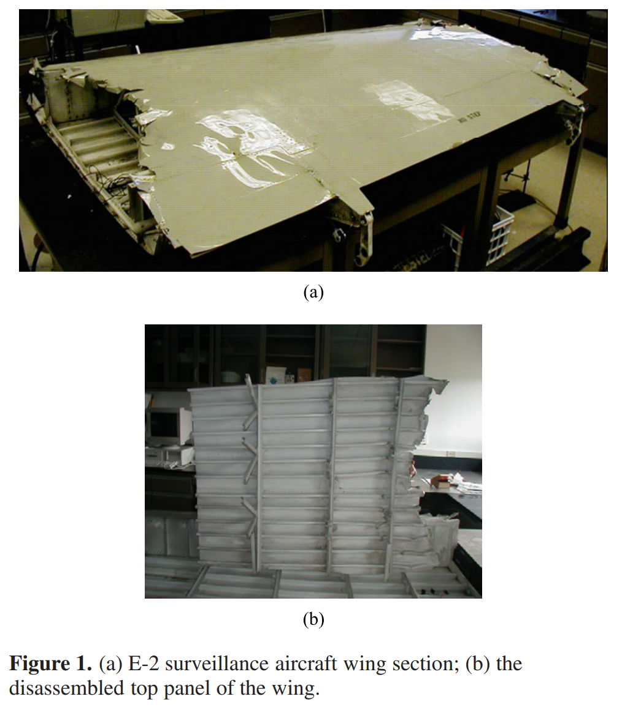
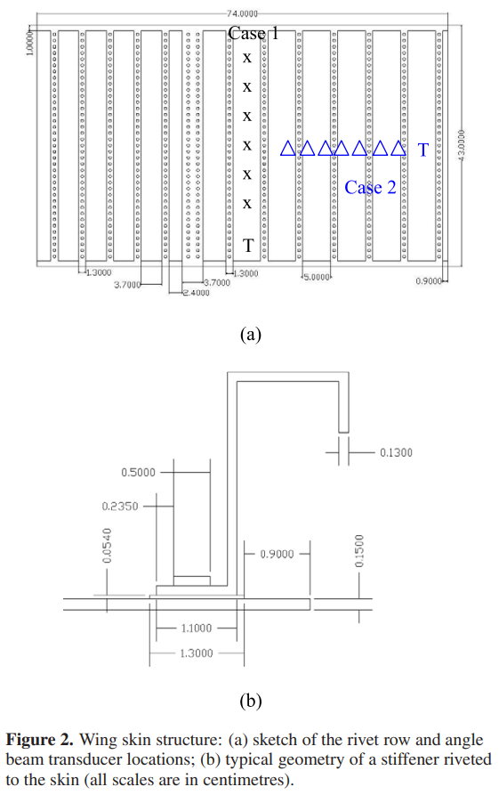
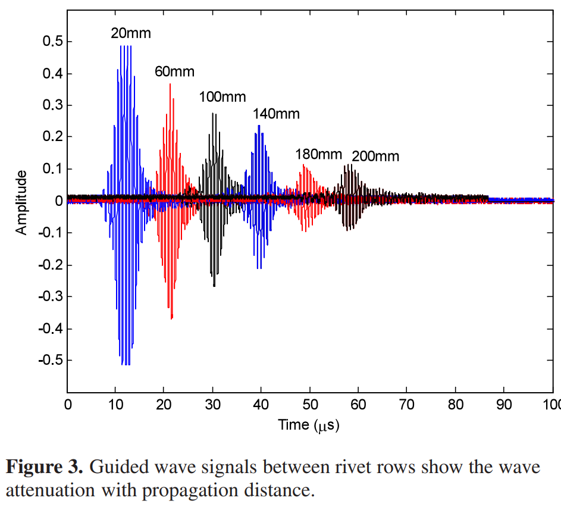
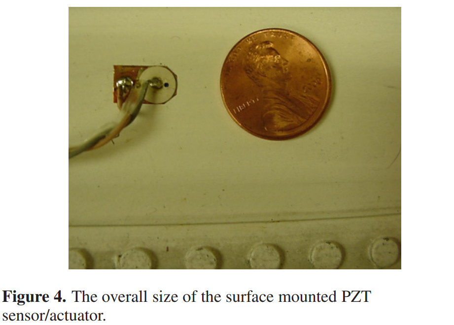
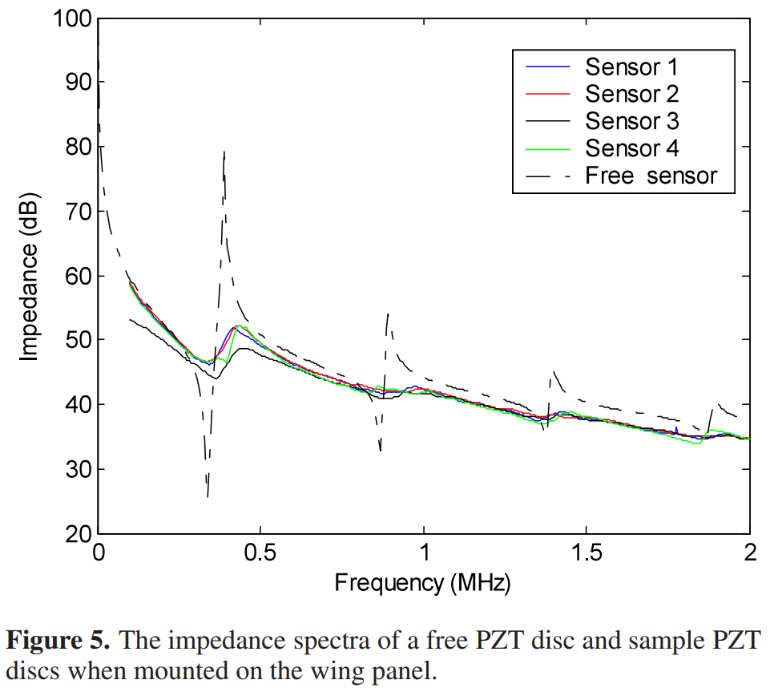
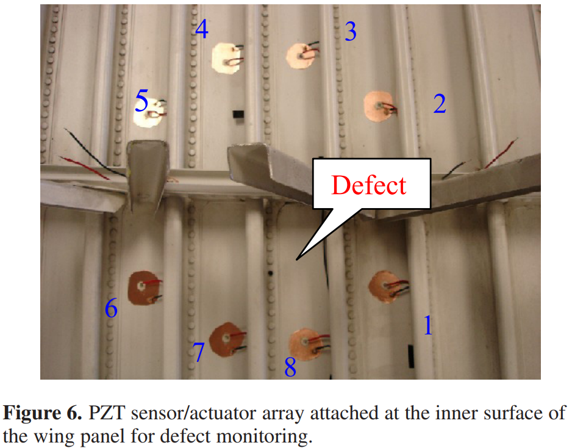
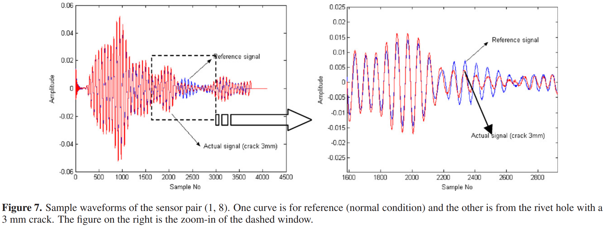
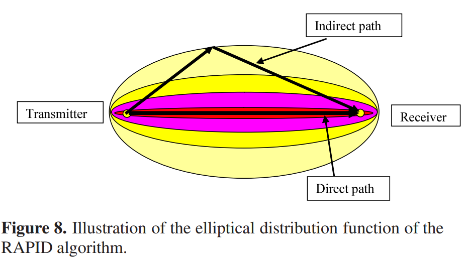

# Active health monitoring of an aircraft wing with embedded piezoelectric sensor/actuator network: I. Defect detection, localization and growth monitoring

具有嵌入式压电传感器/执行器网络的飞机机翼的主动健康监测：I. 缺陷检测、定位和增长监测

[TOC]

## 1. Introduction

> The flight environment is very harsh due to large changes in humidity, temperature, pressure, speed, and loading conditions. These effects cause a lot of stress to the aircraft frame. As a result, corrosion, delamination, cracks, disbonds, and other failures creep in once the aircraft is in service for some time. Traditionally, visual inspection, accompanied by ultrasound bulk wave or eddy current technology, is often used to obtain general information on the structural health conditions. However, the inspection is limited to a point-bypoint manner and is very time consuming. In most cases, erection of scaffolding or disassembly of the structure is needed to inspect the interior and inaccessible components, being very labour intensive and possibly also resulting in maintenance-induced damages. The development of a general, in situ health monitoring system that can inspect a relatively large area, instantaneously provide reliable and quantitative structural health data such as defect type, location and severity level, minimize and eventually eliminate the need for structural disassembly, and communicate wirelessly and remotely to the inspector or maintenance personnel is the objective and motivation of this study.

由于湿度、温度、压力、速度和负载条件的巨大变化，飞行环境非常恶劣。这些影响会对飞机框架造成很大的压力。因此，一旦飞机投入使用一段时间，腐蚀、分层、裂缝、脱胶和其他故障就会蔓延。传统上，结合超声波体波或涡流技术的目视检查通常用于获取有关结构健康状况的一般信息。然而，检查仅限于逐点方式，并且非常耗时。在大多数情况下，需要架设脚手架或拆卸结构来检查内部和难以接近的部件，这是非常劳动密集型的，并且还可能导致维护引起的损坏。开发一种通用的原位健康监测系统，可以检查相对较大的区域，即时提供可靠和定量的结构健康数据，如缺陷类型、位置和严重程度，最大限度地减少并最终消除结构拆卸的需要，并进行无线通信远程检查员或维护人员是本研究的目的和动机。

> Ultrasonic guided waves are elastic waves propagating in solids with boundaries [1–3]. It has been used for nondestructive inspection (NDI) of various defects in aircraft structures [4–6]. Some major advantages of this technique include fast scanning capabilities, low cost, long-range  Recently, small and conformal piezoelectric ceramics and wafer transducers, either being surface mounted or embedded leave-in-place on the structures, have been widely studied for generating and receiving guided waves for structural integrity monitoring. Keilers and Chang [7], Ihn and Chang [8, 9] and Yang and Chang [10, 11] used the built-in piezoelectric transducers for delamination identification in composite plates, fatigue crack detection and growth monitoring in riveted lap joints and repair patches, and bolt joint loosening inspection in composite thermal protection panels, respectively. A commercial product named SMART layer was developed stemming from the sensor/actuator network concept [12]. Giurgiutiu et al [13] studied the ultrasonic waves in beams and plates using an embedded piezoelectric wafer active sensor(PWAS). Maximum coupling is achieved when the PWAS length equals half the wavelength of a particular Lamb wave mode while other modes are minimized. Thus, mode tuning can be achieved with the variation of PWAS dimensions [14]. The composite wing-to-spar bonded joints were inspected with the guided wave PZT disks by Matt et al [15]. Several applications of a PZT transducer in various materials and structures such as plates and sandwiched beams were also reported by Lin and Yuan [16], Yang and Qiao [17], and Annamdas and Soh [18]. However, there is still a lack of an effective algorithm to co-operatively process the PZT sensor network data to yield accurate defect detection, size estimation and localization, especially in a large and complex structure where a single and simple defect signal is not readily available due to the effects of multipath, multimodes, strong wave scattering and attenuation, etc.

超声波导波是在具有边界的固体中传播的弹性波[1-3]。它已被用于飞机结构中各种缺陷的无损检测 (NDI) [4-6]。该技术的一些主要优点包括快速扫描能力、低成本、远距离最近，小型和保形压电陶瓷和晶片换能器，无论是表面安装还是嵌入在结构上，已被广泛研究用于生成和接收用于结构完整性监测的导波。 Keilers 和 Chang [7]、Ihn 和 Chang [8, 9] 以及 Yang 和 Chang [10, 11] 使用内置压电传感器进行复合板的分层识别、铆接搭接接头的疲劳裂纹检测和生长监测以及修复分别对复合热防护板进行补片和螺栓接头松动检查。基于传感器/执行器网络概念 [12] 开发了一个名为 SMART 层的商业产品。 Giurgiutiu 等人 [13] 使用嵌入式压电晶片有源传感器 (PWAS) 研究了梁和板中的超声波。当 PWAS 长度等于特定 Lamb 波模式波长的一半而其他模式最小化时，实现最大耦合。因此，模式调谐可以通过 PWAS 尺寸的变化来实现 [14]。 Matt 等人 [15] 用导波 PZT 圆盘检查了复合翼梁粘合接头。 Lin 和 Yuan [16]、Yang 和 Qiao [17] 以及 Annamdas 和 Soh [18] 还报道了 PZT 换能器在各种材料和结构（例如板和夹层梁）中的几种应用。然而，仍然缺乏一种有效的算法来协同处理 PZT 传感器网络数据以产生准确的缺陷检测、尺寸估计和定位，特别是在单个简单缺陷信号不易获得的大型复杂结构中由于多径、多模、强波散射和衰减等的影响。

> An aircraft wing is a very complex structure, with all the skin panels, spars, ribs and stiffeners riveted together. Under high cyclic loads or corrosive environment, fatigue cracks may initiate from the rivet holes and go span-wise along the stiffeners or spars. Xiao et al [19] reported their study on the fatigue endurance of three aircraft flap-like box structures made of various materials (aluminium alloy, CFRP and GLARE) under acoustic loading. NDT examinations are still needed to characterize those defects. In this paper, the guided wave PZT sensor/actuator network technique was applied to an aircraft wing section for defect monitoring. Specifically, an E-2 surveillance aircraft wing section was cut into pieces for experimental studies. A preliminary test with angle beam Lamb wave transducers on the wing panel was conducted first to evaluate the wave propagation capabilities. Strong attenuations and scattering from the paint and rivet rows have a negative influence on the wave inspection range. A relatively sparse PZT array with a diameter of 1 foot was then bonded to the inner surface of the wing to generate and receive ultrasonic guided waves. Simulated defects such as loose rivets, rivet-hole cracks and material loss on the wing panel were studied. To interpret the signals collected from the PZT disc array, a correlation analysis based algorithm called RAPID was developed for defect detection, localization and growth monitoring [20]. Good results were obtained for mapping the simulated defects on the wing panel. It should be noted that the actual defects on an aircraft wing may be different from the machined defects, and the sensor responses are likely to be different. The work presented here intends to demonstrate the feasibilities of the PZT actuator/sensor network and RAPID algorithms for SHM of a real aircraft structure.

飞机机翼是一个非常复杂的结构，所有蒙皮板、翼梁、加强筋和加强筋都铆接在一起。在高循环载荷或腐蚀环境下，疲劳裂纹可能从铆钉孔开始，并沿加强筋或翼梁向翼展方向发展。肖等人 [19] 报告了他们对三种由各种材料（铝合金、CFRP 和 GLARE）制成的飞机襟翼盒结构在声学载荷下的疲劳耐久性的研究。仍然需要 NDT 检查来表征这些缺陷。本文将导波 PZT 传感器/执行器网络技术应用于飞机机翼部分的缺陷监测。具体来说，将 E-2 侦察机的机翼部分切成小块进行实验研究。首先对机翼面板上的角束兰姆波换能器进行了初步测试，以评估波的传播能力。油漆和铆钉行的强烈衰减和散射对波浪检测范围有负面影响。然后将直径为1英尺的相对稀疏的PZT阵列粘合到机翼的内表面以产生和接收超声波导波。对翼板上的铆钉松动、铆孔裂纹和材料损失等模拟缺陷进行了研究。为了解释从 PZT 圆盘阵列收集的信号，开发了一种称为 RAPID 的基于相关分析的算法，用于缺陷检测、定位和生长监测 [20]。将模拟缺陷映射到机翼面板上获得了良好的结果。应该注意的是，飞机机翼上的实际缺陷可能与机加工缺陷不同，传感器响应也可能不同。这里介绍的工作旨在证明 PZT 执行器/传感器网络和真实飞机结构 SHM 的 RAPID 算法的可行性。

## 2. Aircraft wing test-bed description

> Figure 1(a) shows an E-2 surveillance airplane wing section that was acquired from the US Navy for this study. It is made of aluminium alloys and coated with paint. For the ease of sensor implementation and experimentation, the top skin of the wing section was disassembled with a plasma cutting tool. Figure 1(b) shows a picture of the disassembled top skin piece. Several samples of the top-skin panel were produced after the dissection, and the inner structures of the wing, such as the Dspars, ribs, and stiffeners, were accessible for the experimental studies.

图 1(a) 显示了从美国海军获得的用于本研究的 E-2 侦察机机翼部分。 它由铝合金制成并涂有油漆。 为了便于传感器实施和实验，机翼部分的顶部蒙皮用等离子切割工具拆卸。 图 1(b) 显示了拆卸的顶部蒙皮片的图片。 解剖后制作了几个顶部蒙皮面板样品，并且机翼的内部结构，例如 Dspars、肋和加强筋，可用于实验研究。

> Figure 2(a) shows a schematic of a piece of the top wing panel and its rivet distribution (in hollow circles). Those rivets are used to fasten the wing panel to the inner structures, such as spars and ribs, but most of them are to strengthen the wing skin with L-shaped stiffeners. Figure 2(b) shows a detailed sketch of a stiffener riveted to the wing skin. As shown in figure 2(b), the wing skin is a bit thicker under the stiffeners than where there is no stiffener. Thickness measurement was carried out with a micrometer. The average thicknesses of the wing skin with paint are about 1.08 and 1.51 mm, respectively, at different wing sections, and the additional thickness beneath the stiffener varies from 0.3 to 0.6 mm.

图 2（a）显示了一块顶部翼板及其铆钉分布（空心圆圈）的示意图。 这些铆钉用于将翼板固定到翼梁和肋条等内部结构上，但大多数是用L形加强筋来加强机翼蒙皮。 图 2(b) 显示了铆接在机翼蒙皮上的加强筋的详细示意图。 如图 2(b) 所示，加劲肋下的机翼蒙皮比没有加劲肋的地方厚一些。 用千分尺进行厚度测量。 涂漆的机翼蒙皮在不同机翼截面的平均厚度分别约为 1.08 和 1.51 mm，加劲肋下方的附加厚度从 0.3 到 0.6 mm 不等。

> The geometric complexities of the wing panel lead to complicated ultrasonic guided wave propagation characteristics. The conventional uniform-thickness plate model is not directly applicable here, since the thickness variation leads to variations in wave speed, mode shape, and mode conversion etc. The wing skin is also coated with at least two layers of paint on the outer surface and one on the inner surface, which attenuates the ultrasonic energy substantially. In addition, the wing panel is distributed with rivet rows in every 6.5 cm and the rivets are spaced less than 9 mm from each other. This introduces great energy scattering and blockage for waves across the rivet rows. We performed an initial wave propagation study on the wing panel with two angle beam transducers in a throughtransmission mode. In the first case, the transducers were put in between two adjacent rivet rows and the receiver moved away from the transmitter (T ), following the ‘x’ line in figure 2(a). Thus the wave propagates mostly parallel to the rivet rows. Figure 3 shows the sample 1.8 MHz S0 mode Lamb wave signals collected when the receiver transducer was 20–200 mm away from the transmitter. Wave amplitude reduction is quite noticeable with distance due to beam spreading, wave leakage to the paint, and attenuation. The average signal attenuation rate was around 0.044 $dB mm^{−1}$ for the $S_0$ mode Lamb wave. In the second case, the transducers were put perpendicular to the rivet rows, with the receiver locations shown in figure 2(a) as ‘$	\Delta$’s. The 1.8 MHz $S_0$ mode Lamb wave propagated across  caused by rivet scattering, plate thickness variation, wave leakage to the stiffener bond joint, etc. The signal shape was also extended in the time domain with multi-path/scattering signals coming in (not shown here). From the above study, it was observed that the attenuation, wave leakage and scattering effects certainly restricted the inspection range of the guided waves. A implementing the guided wave actuator/sensor networks.

翼板的几何复杂性导致复杂的超声波导波传播特性。传统的等厚板模型在这里不能直接应用，因为厚度的变化会导致波速、振型和模式转换等的变化。机翼蒙皮在外表面也至少涂有两层油漆，一个在内表面上，它大大衰减了超声波能量。此外，翼板每6.5厘米分布一排铆钉，铆钉间距小于9毫米。这为穿过铆钉行的波引入了巨大的能量散射和阻塞。我们在机翼面板上进行了初始波传播研究，其中两个角度波束换能器处于直通模式。在第一种情况下，传感器被放置在两个相邻的铆钉行之间，并且接收器从发射器 (T) 移开，沿着图 2(a) 中的“x”线移动。因此波传播主要平行于铆钉行。图 3 显示了当接收器传感器距离发射器 20–200 mm 时收集的样本 1.8 MHz S0 模式 Lamb 波信号。由于光束扩散、波泄漏到涂料和衰减，波幅减小随距离变化非常明显。 $S_0$ 模式 Lamb 波的平均信号衰减率约为 0.044 dB $mm^{−1}$。在第二种情况下，传感器垂直于铆钉行放置，接收器位置如图 2(a) 所示，为“$\Delta$”。 1.8 MHz $S_0$ 模式 Lamb 波在铆钉散射、板厚变化、波泄漏到加强筋粘合接头等引起的传播。信号形状也在时域扩展，多路径/散射信号进入 (此处未显示）。从以上研究可以看出，衰减、漏波和散射效应确实限制了导波的检测范围。实现导波致动器/传感器网络。

## 3. PZT transducer array network for wing panel SHM

> Lead zirconate titanate (PZT) is a piezoelectric material with a high electromechanical coupling coefficient. It is widely used in acoustic and ultrasonic devices to generate and receive acoustic waves. The PZT disc transducers used in our experiment are made of PZT ceramics with silver electrodes on both sides of the discs. They were ordered from American Piezo Ceramics Inc (material model 850). When the transducer is electrically polarized in the thickness direction, several vibration modes can be excited by applying an ac voltage between the top and bottom electrode. A sample of the PZT disc transducer used in our experiment is shown in figure 4. The thickness and diameter of the ceramic are 10 mils(0.254 mm) and 1/4 in. (6.3 mm), respectively. Generally, two vibration modes can be excited in this thickness polarized disc: thickness mode and radial mode. The mode frequencies are controlled by the design parameters of the thickness and diameter together with the material properties. Radial resonance was used in this ultrasonic guided wave experiment. Thickness resonance can also be observed with comparably lower wave excitation efficiency at higher frequency.

锆钛酸铅（PZT）是一种具有高机电耦合系数的压电材料。它广泛用于声学和超声波设备中以产生和接收声波。我们实验中使用的 PZT 圆盘换能器由 PZT 陶瓷制成，圆盘两侧均带有银电极。它们是从 American Piezo Ceramics Inc（材料型号 850）订购的。当换能器在厚度方向上被电极化时，可以通过在顶部和底部电极之间施加交流电压来激发几种振动模式。我们实验中使用的 PZT 圆盘换能器样品如图 4 所示。陶瓷的厚度和直径分别为 10 密耳（0.254 毫米）和 1/4 英寸（6.3 毫米）。通常，在这种厚度极化盘中可以激发两种振动模式：厚度模式和径向模式。模式频率由厚度和直径的设计参数以及材料特性控制。在这个超声波导波实验中使用了径向共振。厚度共振也可以在较高频率下以较低的波激发效率观察到。

> To attach a PZT sensor to the wing structures, the surface of the wing section is cleaned first with alcohol, and a copper tape is attached to the cleaned surface. Then a PZT disc is glued on top of the copper tape with conductive epoxy. Finally, a lead wire is soldered or glued with conductive epoxy to the top surface of the sensor to serve as the signal wire and the copper tape is used as the electrical ground. To insulate the sensor and protect it from shock or vibration, the sensor assembly could be covered with epoxy, with only the signal and ground wires leading out. The electric mechanical impedances of the sensors were measured with an impedance analyser (HP 4192) to check their performance. The decibel scale impedance was obtained from the reading of an impedance analyser’s $Z_\Omega$ with $Z_{dB} = 20log_{10}(|Z_\Omega|)$. In figure 5, the dashed curve shows the free vibration disc in air; and the solid curves show the PZT impedance after being bonded to the wing  the free vibration curve corresponds to the resonance in the radial direction of the disc. The higher-order resonances are  the wing skin, the resonance phenomenon is not as significant as the free vibration condition. However, operation around 350 kHz still has good wave excitation efficiency. Furthermore, the sensor implementation uniformity and potential differences in the mechanical properties of the wing panel cause slight differences in the impedance spectra of these attached sensors.

要将 PZT 传感器连接到机翼结构上，首先用酒精清洁机翼部分的表面，然后将铜带贴在清洁后的表面上。然后用导电环氧树脂将 PZT 圆盘粘在铜带上。最后，将导线焊接或用导电环氧树脂胶粘到传感器的顶部表面，作为信号线，铜带用作电气接地。为了使传感器绝缘并保护其免受冲击或振动，传感器组件可以用环氧树脂覆盖，只有信号线和地线引出。使用阻抗分析仪 (HP 4192) 测量传感器的电气机械阻抗以检查其性能。分贝阻抗是从阻抗分析仪的 $Z_\Omega$ 读数中获得的，其中 $Z_{dB} = 20log_{10}(|Z_\Omega|)$。在图5中，虚线表示空气中的自由振动盘；实线表示与机翼粘合后的PZT阻抗，自由振动曲线对应于圆盘径向的共振。高阶共振是机翼蒙皮，共振现象不如自由振动条件显着。然而，在 350 kHz 附近运行仍具有良好的波激发效率。此外，传感器实现的一致性和翼板机械性能的电位差会导致这些附加传感器的阻抗谱略有不同。

> For demonstration purposes, a circular array configuration of the PZT transducer network was implemented on the wing panel for defect monitoring. Such a configuration should be useful for monitoring a well-defined region or a structural ‘hot spot’ where defects are most likely to occur. In our study, eight piezo-ceramic discs were attached to the aircraft wing surface in a circle about 10 inches in diameter. The discs are nearly equally spaced. Figure 6 shows the example array, with arabic numbers 1, 2,..., 8 marked nearby to identify each PZT. A MATEC TB-1000 tone burst pulser/receiver card was used to generate and receive the ultrasonic signals. A 100 V peak-to-peak 350 kHz windowed sinusoidal signal (three to four cycles) was used to drive the PZT actuator. The PZT discs take turns generating ultrasonic signals while the rest of them are listening. For example, when disc 1 is sending a signal, sensors 2–8 are in the reception mode; then disc 2 is transmitting signals and sensors 1, 3–8 are listening, and so on. The waveforms of each actuator-sensor pairs are collected. Figure 7 shows an example waveform collected from actuatorsensor pairs 1 and 8 with and without a crack. Note that at 350 kHz, S0 and A0 mode Lamb waves could exist in the wing panel; besides, the scattering of the guided waves from the rivet rows also complicated the waveform, therefore it is difficult, if not impossible, to identify the wave modes from the raw signal. A physics-based statistical data processing algorithm is thus developed for real-time processing of the data so that the defect presence, growth, and location can be monitored effectively. Of course, for applying the PZT actuator/sensor network to a general structure, the single circular array configuration could be expanded to a network of arrays in hexagons, for example, so that a large structural area could be monitored.

出于演示目的，在翼板上实施了 PZT 换能器网络的圆形阵列配置，用于缺陷监测。这种配置对于监控最有可能出现缺陷的明确定义的区域或结构“热点”应该很有用。在我们的研究中，八个压电陶瓷盘以直径约 10 英寸的圆形连接到飞机机翼表面。圆盘几乎等间距。图 6 显示了示例数组，在附近标记了阿拉伯数字 1、2、...、8 以识别每个 PZT。 MATEC TB-1000 音调脉冲发生器/接收卡用于产生和接收超声波信号。使用 100 V 峰峰值 350 kHz 加窗正弦信号（三到四个周期）来驱动 PZT 致动器。 PZT 圆盘轮流产生超声波信号，而其余的圆盘正在监听。例如，当圆盘 1 发送信号时，传感器 2-8 处于接收模式；然后光盘 2 正在传输信号，传感器 1、3-8 正在监听，依此类推。收集每个致动器-传感器对的波形。图 7 显示了从执行器传感器对 1 和 8 收集的示例波形，有裂纹和无裂纹。请注意，在 350 kHz 时，S0 和 A0 模式 Lamb 波可能存在于机翼面板中；此外，来自铆钉行的导波的散射也使波形复杂化，因此即使不是不可能，也很难从原始信号中识别波模式。因此，开发了一种基于物理的统计数据处理算法，用于实时处理数据，从而可以有效地监控缺陷的存在、增长和位置。当然，为了将 PZT 致动器/传感器网络应用于一般结构，例如，可以将单个圆形阵列配置扩展到六边形阵列网络，以便可以监控大的结构区域。

## 4. Defect characterization with correlation analysis and RAPID

> Defect detection, growth monitoring and location mapping with guided wave arrays has been studied through computer tomography approaches, using wave speed, attenuation or energy as features for image reconstruction [21, 22]. While accurate defect images can be obtained, however, those approaches are quite time consuming and the sensitivity is not satisfactory with sparse sensors. A simple yet effective correlation analysis technique was developed in this study to detect small defects by measuring the differences in the guided wave signals between normal and faulty conditions. Specifically, the initial waveforms taken after the sensor array is installed on a structure are used as the reference data. New signals collected afterwards are compared with the reference data to identify if there is a major change in the signal characteristics. Given the same environmental and measurement conditions, this change is attributed to the defect initiation. The growth of the defect can also be monitored by tracing the increase in the signal difference from the normal condition. In a simple mathematical formula, the signal change can be represented by a correlation coefficient $ρ$ given by

已经通过计算机断层扫描方法研究了使用波速、衰减或能量作为图像重建特征的导波阵列的缺陷检测、生长监测和位置映射 [21, 22]。然而，虽然可以获得准确的缺陷图像，但这些方法非常耗时，并且对于稀疏传感器的灵敏度并不令人满意。本研究开发了一种简单而有效的相关分析技术，通过测量正常和故障条件之间导波信号的差异来检测小缺陷。具体而言，将传感器阵列安装在结构上后获取的初始波形用作参考数据。之后收集的新信号将与参考数据进行比较，以确定信号特征是否有重大变化。在相同的环境和测量条件下，这种变化归因于缺陷的产生。也可以通过跟踪与正常情况的信号差的增加来监测缺陷的生长。在一个简单的数学公式中，信号变化可以用相关系数 $\rho$ 表示
$$
\rho=\frac{C_{XY}}{\sigma_X\sigma_Y}
\tag{1}
$$

> where $C_{XY}$ is the covariance of $X$ and $Y$ given by

其中 $C_{XY}$ 是 $X$ 和 $Y$ 的协方差

$$
C_{XY}=\sum_{k=1}^K (X_k-\mu_x)(Y_k-\mu_y)
\tag{2}
$$

> where $\mu$ is the mean of the respective data set and $K$ is the length of the data set. In this case, the data set $X$ is the reference data and $Y$ is each new set of data recorded after a period of service time. $\sigma_x$ and $\sigma_y$ are the standard deviations of $x$ and $y$, respectively, with their product given by

其中$\mu$ 是相应数据集的平均值，$K$ 是数据集的长度。 在这种情况下，数据集 $X$ 是参考数据，$Y$ 是经过一段时间服务时间后记录的每组新数据。 $\sigma_x$ 和 $\sigma_y$ 分别是 $x$ 和 $y$ 的标准差，它们的乘积为
$$
\sigma_X\sigma_Y=\sqrt{\sum_{k=1}^K (X_k-\mu_X)^2}\sqrt{\sum_{k=1}^K (Y_k-\mu_Y)^2}
\tag{3}
$$

> In order to determine the location of the defect, we assume that the probability of a defect occurrence at a certain point can be estimated from the severity of the signal changes of different sensor pairs as a result of this defect and its relative position to the sensor pairs. The physical intuition behind this is that a defect would cause the most significant signal change in the direct wave path, and that the signal change effect would decrease if the defect is away from the direct path of the sensor pair. (Note that there might be cases that mirror reflection exists with the defect and the above assumption does not apply; the statistical nature of multiple sensor pairs can accommodate it to some extent.) The defect distribution probability within the sensor network can thus be expressed as a linear summation of all the signal change effects of every possible transmitter-receiver pair, each of which has a spatial distribution. Here a simple linearly decreasing elliptical distribution is assumed, with the transmitter and receiver PZT at the foci. Assuming there are total $N$ PZT elements in an array cluster of a sensor network, the estimation of the defect probability at position $(x, y)$ within the reconstruction region $P(x, y)$ can be written as

为了确定缺陷的位置，我们假设可以根据不同传感器对的信号变化的严重程度以及该缺陷与传感器的相对位置来估计某一点出现缺陷的概率对。这背后的物理直觉是，缺陷会导致直接波路径中最显着的信号变化，如果缺陷远离传感器对的直接路径，信号变化效果会降低。 （请注意，可能存在与缺陷一起存在镜面反射的情况，上述假设不适用；多个传感器对的统计性质可以在一定程度上适应它。）因此，传感器网络内的缺陷分布概率可以表示为每个可能的发射器-接收器对的所有信号变化效应的线性总和，其中每个都具有空间分布。这里假设一个简单的线性递减椭圆分布，发射器和接收器 PZT 在焦点处。假设在传感器网络的阵列簇中总共有 $N$ 个 PZT 元素，则重建区域 $P(x,y)$ 内位置 $(x,y)$ 处的缺陷概率的估计可以写为
$$
P(x,y)=\sum_{i=1}^{N-1}\sum_{j=i+1}^N P_{ij}(x,y)=\sum_{i=1}^{N-1}\sum_{j=i+1}^N A_{ij}[\frac{\beta-R_{ij}(x,y)}{\beta-1}]
\tag{4}
$$

> Here, $P_{ij}(x,y)$ is the defect distribution probability estimation from the transmitter $i$ and receiver $j$ sensor pair, $S_{ij}$ . $A_{ij}$ is the signal difference coefficient (SDC) of the sensor pair $S_{ij}$ and $A_{ij}=1−\rho_{ij}$ , following equation (1). Note that, due to reciprocity, the signal collected from sensor pair $S_{ji}$ should be the same as that from $S_{ij}$ , thus only $N(N−1)/2$ sets of data are needed. In the real experiment, the signal of sensor pair $S_{ji}$ was still collected for verification and averaging purpose. $(\beta−R_{ij}(x, y))/(\beta−1)$ is the non-negative linearly decreasing spatial distribution function of $S_{ij}$ , with its contour in the shape of a set of ellipses. Figure 8 shows the geometric interpretation of this distribution function. In the formula,

这里，$P_{ij}(x,y)$ 是来自发射器 $i$ 和接收器 $j$ 传感器对 $S_{ij}$ 的缺陷分布概率估计。 $A_{ij}$ 是传感器对 $S_{ij}$ 和 $A_{ij}=1−\rho_{ij}$ 的信号差系数 (SDC)，遵循等式 (1)。 请注意，由于互易性，从传感器对 $S_{ji}$ 收集的信号应该与从 $S_{ij}$ 收集的信号相同，因此只需要 $N(N−1)/2$ 组数据 . 在实际实验中，传感器对$S_{ji}$的信号仍然被收集用于验证和平均目的。 $(\beta−R_{ij}(x, y))/(\beta−1)$ 是 $S_{ij}$ 的非负线性递减空间分布函数，其轮廓为集合形状 的椭圆。 图 8 显示了该分布函数的几何解释。 在公式，
$$
R_{ij}=
\begin{cases}
RD_{ij}(x,y) & \mbox{when } RD_{ij}(x,y)<\beta \\
\beta & \mbox{when } RD_{ij}(x,y)\geqslant\beta
\end{cases}
\tag{5}
$$

> where

$$
RD_{ij}(x,y)=\frac{\sqrt{(x-x_i)^2+(y-y_i)^2}+\sqrt{(x-x_j)^2+(y-y_j)^2}}{\sqrt{(x_j-x_i)^2+(y_j-y_i)^2}}
$$

> is the ratio of the sum of distance of the point $(x,y)$ to the transmitter $i$ and receiver $j$ (the focal radii) to the distance between the transmitter and receiver. $\beta$ is a scaling parameter which controls the size of the effective elliptical distribution area, and $\beta>1$. When $R_{ij}(x,y)=1$, i.e. the point $(x,y)$ is on the direct line of the transmitter–receiver pair $S_{ij}$, $P_{ij}=A_{ij}$; when $R_{ij}(x,y)=\beta$, i.e. the point $(x,y)$ is on the boundary of the effective distribution area, $P_{ij}=0$. Usually, $\beta$ is selected to be around 1.05. Artifacts will be introduced if $\beta$ is too small, and resolution is lost if $\beta$ is too large. Generally, if a defect occurs, a set of sensor pair signals will be affected. As a result, in the defect  located will have dominantly larger probability compared to the other points. Consequently, by applying image processing techniques, such as judiciously selecting a threshold to the defect estimation image, the defect location can be estimated.

是点 $(x,y)$ 到发射器 $i$ 和接收器 $j$ 的距离之和（焦点半径）与发射器和接收器之间的距离之比。 $\beta$ 是控制椭圆有效分布区域大小的缩放参数，$\beta>1$。当$R_{ij}(x,y)=1$，即点$(x,y)$在发射机-接收机对$S_{ij}$的直线上，$P_{ij}=A_ {ij}$;当$R_{ij}(x,y)=\beta$，即点$(x,y)$在有效分布区域的边界上，$P_{ij}=0$。通常，$\beta$ 选择在 1.05 左右。如果$\beta$ 太小，则会引入伪影，如果$\beta$ 太大，则会丢失分辨率。通常，如果出现缺陷，一组传感器对信号将受到影响。结果，与其他点相比，位于缺陷中的概率明显更大。因此，通过应用图像处理技术，例如明智地选择缺陷估计图像的阈值，可以估计缺陷位置。

