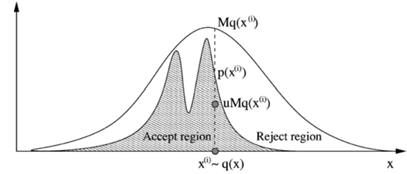

# 2022.04.15 汇报 MCMC 蒙特卡洛马尔可夫链介绍与实际应用

姚澄宇 18013108

[TOC]

## 背景

在统计学中，经常会遇到高维积分的计算，用传统的数值方法往往很难解决高维积分计算问题。不过，通过随机模拟的方法为解决这些高维积分问题提供了一个思路。所谓随机模拟方法，是使通过随机变量函数的概率模拟或随机抽样求解工程技术问题的近似数值解的概率统计方法。

马尔可夫链蒙特卡洛MCMC，就是其中一种应用广泛的模拟方法，使得统计学领域中极大似然估计、非参数估计、贝叶斯统计学等方向上的很多问题得到了解决。

## 蒙特卡洛采样方法

当前许多科学问题所碰上的函数都可以看成积分的形式：$I=\int_{D}f(x)dx$ 。当然，如果 $f(x)$ 相当容易的话是再好不过的，但是经常来说 $D$ 通常是高维空间中的区域，此时使用积分求解原函数需要大量的计算量，因此使用数学概率相关方法可以另辟蹊径。

假设随机变量函数 $Y=g(x)$，概率密度函数 $\pi(x)$ 满足 $\int_{D}g(x)\pi(x)dx$ 收敛，则有：
$$
E(Y) = E[g(x)] = \int_{D}g(x)\pi(x)dx
$$
对于 $f(x)$ 而言来说，他可以被分解成为随机变量函数 $g(x)$ 与一个概率分布函数 $\pi(x)$ 的乘积，即 $g(x)$ 在密度 $\pi(x)$ 下的期望 $f(x)$：
$$
E(Y) = E[g(x)] = \int_{D}g(x)\pi(x)dx = \int_{D}f(x)dx = I
$$
我们只要能过获得足够多的关于 $\pi(x)$ 的独立样本 $X^{(1)},\ldots,X^{(n)}$ 就能获得 $I$ 的近似值 $\hat I_n$：
$$
\hat I_n = \frac{1}{n} \sum_{i=1}^n g(X^{(i)})
$$
同时：
$$
\lim_{n \to \infty}\hat I_n = I
$$
 这就是Monte Carlo积分，接下来我们只需要获得从已知分布中怎么采样。

###  接受-拒绝采样

假设已知概率密度函数 $P(x)$，想要进行采样，但是其累积概率密度函数可能很难通过积分计算得到，或者它的反函数也不容易计算。这时可以考虑拒绝采样。我们首先构造提议分布 $Q(x)$，这个函数相对容易采样。然后我们找一个常数 $c$，将其与 $Q(x)$ 相乘之后，即 $c*Q(x)$ 将 $P(x)$ 完全罩住。如下图所示，相当于 $cQ(x)$ 给 $P(x)$ 划定了上界。

在 $cQ(x)$ 内以 $[0, 1]$ 进行均匀分布采样：

 如果采样点落在函数 $P(x)$ 的曲线下方，则接收这个采样，否则拒绝。

因此采样步骤为：

- 从备选分布 $q(x)$ 中抽样，得到样本 $x_i$

- 从均匀分布 $U[0, 1]$ 中抽样，得到样本 $u$

- 如果存在 $u < \frac{p(x^{(i)})}{Mq(x^{(i)})}$，则接受样本 $x_i$，否则拒绝

$Mq(x^{(i)})$ 与 $p(x)$ 越接近，接受率越高，采样效率也越高。设计合适的采样函数有利于样本的获得。

## MCMC 蒙特卡洛马尔可夫链

蒙特卡洛方法的一个基本步骤是产生(伪)随机数，使之服从目标概率分布 $\pi(x)$，当 $x$ 是一维的时候就如同上文提到的方法一样容易。但是将 $x$ 放在一个复杂的高位密度函数中，就很难进行抽样，因此引入马尔可夫链。

### 马尔可夫链

接下来介绍下有关马氏链的基本知识，假设 ${Xt: t≥0}$ 是随机序列，随机序列所有可能取到的值组成的集合记为S，称为**状态空间**(马氏链每个节点上采样样本)。如果对于 $\forall t \ge 0$ 及任意状态 $s_i,s_j,s_{i_0},\ldots,s_{i_{t-1}}$ 都有：
$$
P(X_{t+1}  =s_j \mid X_t = s_j,\ldots,X_0 = s_{i_0}) = P(X_{t+1}  =s_j \mid X_t = s_j)
$$
则称 ${Xt: t≥0}$ 为马氏链。直观上看对于马氏链(马氏过程)，要预测将来的唯一有用信息就是过程当前的状态，而与以前的状态无关。马氏链的性质完全由它的转移概率(转移核)来决定，它是由状态 $s_i$到状态 $s_j$ 的一步转移概率，这里用 $P(i, j)$ 表示，即：
$$
P(i, j) = P(X_{t+1}  =s_j \mid X_t = s_j)
$$
定义一个转移概率矩阵 $P$，$P(i,j)$ 就是从状态i转移到状态j的概率。这意味着此矩阵每一行元素的和为1。

### 平稳分布

假设我们定义一个状态转移矩阵
$$
\begin{bmatrix}
0.1 & 0.2 & 0.7 \\
0.5 & 0.5 & 0 \\
0.6 & 0.3 & 0.1
\end{bmatrix}
$$
随机设定一个初始状态概率，经过多次变换后总能得到一个稳定的关于状态转移矩阵的概率结果。经过 $k$ 步后，我们的马尔科夫链模型的状态转移矩阵收敛到的稳定概率值与初始状态概率值无关，马氏链达到了一个平稳分布 $\pi^*$，平稳分布的数学表达。因此就可以说：
$$
\pi(x^*) = \int \pi(x) P(x, x^*)dx
$$
我们是要对目标概率分布进行采样。我们利用马氏链收敛于平稳分布的性质，构造马氏链(包括状态随机变量及状态转移矩阵)。经过若干次迭代在t=k时刻马氏链达到平稳分布，我们认为此时的状态分布收敛于/逼近目标分布，那么整个马氏链 $t=0$ 到 $t=k$ 所有随机变量状态即为目标分布的采样。

## Metroplis-Hasting算法

在Metropolis-Hastings采样算法的过程中，首先初始化状态值 $\theta^{(1)}$，然后利用一个已知的分布 $q(\theta \mid \theta^{(t-1)})$ 生成一个新的候选状态 $\theta^{(*)}$，随后根据一定的概率选择接受这个新值，或者拒绝这个新值。这样的过程一直持续到采样过程的收敛，当收敛以后，样本 $θ(t)$ 即为目标分布 $p(θ)$ 中的样本。

- 初始化时间 t = 1
- 设置 $u$ 的值，并初始化初始状态 $\theta^{(t)} = u$
- 重复以下的过程：
  - $t = t + 1$
  - 从已知分布 $q(\theta \mid \theta^{(t-1)})$ 中生成一个候选状态 $\theta^{(*)}$
  - 计算接受的概率
  - 从均匀分布 $U[0, 1]$ 生成一个随机数 $a$
  - 如果小于接受阈值，接受新生成的值 $\theta^{(t)} = \theta^{(*)}$，否则 $\theta^{(t)} = \theta^{(t-1)}$

- 直到达到时间上线 $t = T$
